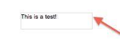

## Colors

### hmRep_clr_ObjectFillcolor (1)
Sets the fill color of an object defined by the parameter ''id''.

### hmRep_clr_ObjectFramecolor (2)
Sets the frame color of an object defined by the parameter ''id''.

### hmRep_clr_ObjectTextcolor (3)
Sets the text color of an object defined by the parameter ''id''.

### hmRep_clr_LayerColor (4)
Sets the color of a [[hmRep_Create Layer|layer]]. You have to pass the layer id in the parameter ''id''.

### hmRep_clr_GuideColor (5)
Sets the color of a specific [[hmRep_Create Guide|guide]]. You have to pass the guide number in the parameter ''id''.

### hmRep_clr_DefaultGuide (6)
Defines the color of new guides, which are created by the user per drag & drop. ''id'' is always 0.

### hmRep_clr_ObjectBounds (7)
Sets the color of the help line to display the object bounds. ''id'' is always 0.
This picture shows the object bounds frame. It only appears, if no frame is visible:

