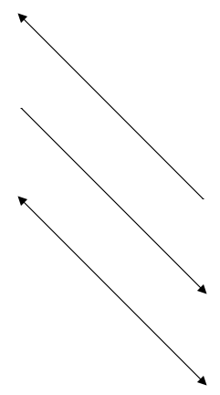
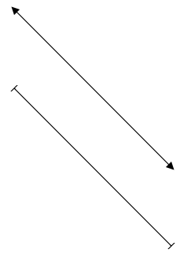
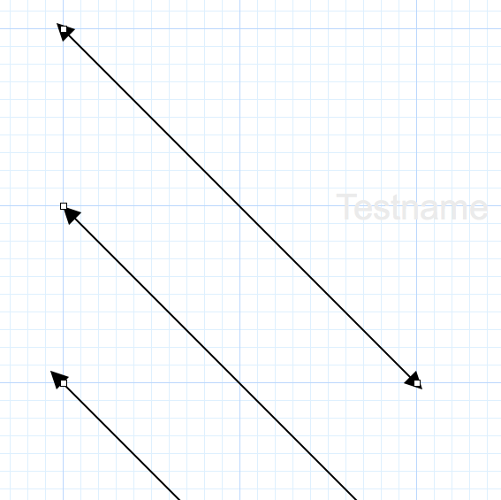
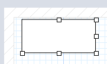

## Object properties

### hmRep_oprop_Type (1)
The parameter *valueReal* returns the object type. This value is read only.
See chapter [Object types](ObjectTypes.md) for all types.

### hmRep_oprop_LayerID (2)
The parameter *valueReal* defines the layer reference of the object.

### hmRep_oprop_GroupID (3)
The parameter *valueReal* returns the object reference of the group. If the object is not in a group, the value is *0*.
To set a new group for the object, just pass the group reference into *valueReal* or pass *0* for no group.

### hmRep_oprop_Name (4)
The parameter *valueText* defines the custom name of the object.

### hmRep_oprop_ShowFrame (5)
The parameter *valueReal* defines the visibility of the frame. Visible is *1*, invisible is *0*.

### hmRep_oprop_ShowFill (6)
The parameter *valueReal* defines if the object is filled with color. Show fillcolor is *1* otherwise *0*.

### hmRep_oprop_Text (7)
The parameter *valueText* sets the text of a textobject.

### hmRep_oprop_Fontname (8)
The parameter *valueText* sets the fontname of the textobject.

### hmRep_oprop_Penwidth (9)
The parameter *valueReal* sets the pen width of the line, rect, oval, path, freehand objects.

### hmRep_oprop_Visible (10)
The parameter *valueReal* sets the visibility of the object. Visible is *1*, invisible is *0*.

### hmRep_oprop_Selectable (11)
The parameter *valueReal* sets the ability to select the object. Selectable is *1* otherwise *0*.

### hmRep_oprop_Selected (12)
The parameter *valueReal* sets if the object is selected. Selected is *1*, not selected is *0*.

### hmRep_oprop_Alpha (13)
The parameter *valueReal* sets the alpha value (opacity) of the object. *100* means 100 %. Only value between 0 and 100 are allowed.

### hmRep_oprop_Rounding (14)
The parameter *valueReal* sets the rounding value of a rounded rect. The value is the radius of the rounding.

### hmRep_oprop_Fontsize (15)
The parameter *valueReal* sets the fontsize of the textobject.

### hmRep_oprop_Fontstyle (16)
The parameter *valueReal* sets the fontstyle of the textobject. You can use the constans from 4D: *Bold*, *Italic* and *Underline* in combination. You can add strike-through text with the number 8.

### hmRep_oprop_PicType (17)
The parameter *valueReal* returns the picture type of a picture object. For a list of all available picture types see chapter [Picture types](PictureTypes.md). This value is read only.

### hmRep_oprop_Wordwrap (18)
The parameter *valueReal* sets the automatic wordwrap of a text object. A value of *1* wraps the text automatically. Otherwise *0*.

### hmRep_oprop_Tableno (19)
The parameter *valueReal* returns the linked table number of the text object. This value is read only.

### hmRep_oprop_Fieldno (20)
The parameter *valueReal* returns the linked field number of the text object. This value is read only.

### hmRep_oprop_AlignmentH (21)
The parameter *valueReal* sets the horizontal alignment of the text object. Following horizontal alignments are supported:

* 1: Align default
* 2: Align Left
* 3: Center 
* 4: Align Right
* 5: Justified

### hmRep_oprop_Antialiasing (22)
The parameter *valueReal* sets the antialiasing of the object. A value of *1* uses antialiasing. Otherwise *0*.

### hmRep_oprop_X (23)
The parameter *valueReal* sets horizontal point of an arc object.

### hmRep_oprop_Y (24)
The parameter *valueReal* sets vertical point of an arc object.

### hmRep_oprop_RadiusX (25)
The parameter *valueReal* sets horizontal radius of an arc object.

### hmRep_oprop_RadiusY (26)
The parameter *valueReal* sets vertical radius of an arc object.

### hmRep_oprop_StartAngle (27)
The parameter *valueReal* sets the start angle of an arc object.

### hmRep_oprop_EndAngle (28)
The parameter *valueReal* sets the start angle of an arc object.

### hmRep_oprop_Clockwise (29)
The parameter *valueReal* sets the clockwise flag of an arc object. *1* means clockwise, *0* means anti-clockwise.

### hmRep_oprop_Gradient (30)
The parameter *valueReal* returns the gradient type of an object. A list of all gradient types s listed in the chapter [Gradient types](GradientTypes.md). This value is read only.

### hmRep_oprop_Clip (31)
The parameter *valueReal* clips the object.

### hmRep_oprop_FormatNumber (32)
The parameter *valueReal* sets the format number of a text object which is linked to data.

### hmRep_oprop_Format (33)
The parameter *valueText* sets the format of a text object which is linked to data.

### hmRep_oprop_BlankIfNull (34)
The parameter *valueReal* sets the "blank of null"-flag of an text object with data. A value of *1* means blank if null, otherwise *0*.

### hmRep_oprop_ShowCalcValue (35)
This value shows the calculated value in this object. Pass *1* in the parameter *valueReal* for *true*, otherwise *0*.

### hmRep_oprop_CalcOption (36)
This property sets the calculation behaviour of the object. Pass the option in the parameter *valueReal*. You can use one of the following constants:

*0 = hmRep_Calc_None
*1 = hmRep_Calc_Total
*2 = hmRep_Calc_Minimum
*3 = hmRep_Calc_Maximum
*4 = hmRep_Calc_Average
*5 = hmRep_Calc_Count

### hmRep_oprop_RecInVariable (37)
If the parameter *valueReal* is set to *1*, the calculation result is set into an other variable specified by the object property *hmRep_oprop_RecVariable*.

### hmRep_oprop_RecVariable (38)
The parameter sets the variable name of the *Record In Variable* flag. Set the variables name into the parameter *valueText*.

### hmRep_oprop_VariableHeight (39)
If the parameter *valueReal* is set to *1*, the object have a variable height and grows with its content. This is only available for text-objects.

### hmRep_oprop_MaxVariableHeight (40)
The parameter *valueReal* indicates the maximum height of a variable to grow. If you pass *0*, the height can be unlimited. To use this value, you must set the *hmRep_oprop_VariableHeight* property to *1*.

### hmRep_oprop_VerticalSizing (41)
The parameter *valueReal* sets the vertical sizing of an object. The following values are allowed:

* 0 = hmRep_Sizing_None
* 1 = hmRep_Sizing_Move
* 2 = hmRep_Sizing_Grow

An object can be automatically moved or resized only, if the detail area is resized, because of growing text-objects with the option *hmRep_oprop_VariableHeight*.

### hmRep_oprop_Smooth (42)
The parameter *valueReal* defines, if a path is smooth drawn or not. Pass *1* for smooth and *0* for not smooth (standard).

### hmRep_oprop_Rotation (43)
The parameter *valueReal* defines the rotation angle in degrees of the object. The objects rotates around the middle point of the object.

### hmRep_oprop_Pictureformat (44)
The parameter *valueReal* defines the picture format (drawmode). You can use the 4D predefined constants:

* Truncated Centered (1)
* Scaled to Fit (2)
* On Background (3)
* Truncated non Centered (4)
* Scaled to fit proportional (5)
* Scaled to fit prop centered (6)
* Replicated (7)

### hmRep_oprop_RotationEdit (54)
The parameter *valueReal* defines, if the object rotation is editable. Pass *1* for editable or *0* for non editable.

### hmRep_oprop_Repeat (55)
The parameter *valueReal* defines, if this object can repeat. Pass *1* for repeat, otherwise *0*.

### hmRep_oprop_use_v_repoffset (56)
The parameter *valueReal* defines, if the vertical repeat offset should be used. Pass *1* for using the offset, otherwise *0*.

### hmRep_oprop_use_h_repoffset (57)
The parameter *valueReal* defines, if the horizontal repeat offset should be used. Pass *1* for using the offset, otherwise *0*.

### hmRep_oprop_v_repoffset (58)
The parameter *valueReal* defines the number of pixels for the vertical offset.

### hmRep_oprop_h_repoffset (59)
The parameter *valueReal* defines the number of pixels for the horizontal offset.

### hmRep_oprop_Multistyle (60)
The parameter *valueReal* defines, if the text object uses multistyle text or not. Pass *1* for multi style, otherwise *0*.

### hmRep_oprop_ArrayContext (61)
The parameter *valueReal* defines the context (detail number) of the object linked to an array. The number indicates which iteration of which detail number is used.

### hmRep_oprop_Pattern (62)
The parameter *valueReal* return the old/obsolete pattern number after a 4D Draw conversion. The value is not stored in the hmReports blob. After a 4D Draw conversion, it's possible to react on object which have special patterns.

### hmRep_oprop_endmark (63)
The parameter *valueReal* defines the endmark of a line, freehand or path object. The following endmarks are available:

* 0=No endmark (Standard)
* 1=Start endmark
* 2=End endmark
* 3=Endmark on both sides (Start+End)

**Example:**
The following code creates three lines with different endmarks (Start, End and Both):

```4d
$vl_id:=hmRep_Create Line(reparea; 100; 100; 300; 300)
hmRep_SET OBJECT PROPERTY(reparea; $vl_id; hmRep_oprop_endmark; 1)

$vl_id:=hmRep_Create Line(reparea; 100; 200; 300; 400)
hmRep_SET OBJECT PROPERTY(reparea; $vl_id; hmRep_oprop_endmark; 2)

$vl_id:=hmRep_Create Line(reparea; 100; 300; 300; 500)
hmRep_SET OBJECT PROPERTY(reparea; $vl_id; hmRep_oprop_endmark; 3)
```
The output:



### hmRep_oprop_endmark_type (64)
The parameter *valueReal* defines the type of the endmark. A value of *1* defines an arrow as endmark, a value of *2* defines a bar as endmark.

**Example:**
The following code creates two lines, one line with an arrow as endmark and one line with a bar as endmark:

```4d
$vl_id:=hmRep_Create Line (reparea;100;100;300;300)
hmRep_SET OBJECT PROPERTY (reparea;$vl_id;hmRep_oprop_endmark;3)
hmRep_SET OBJECT PROPERTY (reparea;$vl_id;hmRep_oprop_endmark_type;1)

$vl_id:=hmRep_Create Line (reparea;100;200;300;400)
hmRep_SET OBJECT PROPERTY (reparea;$vl_id;hmRep_oprop_endmark;3)
hmRep_SET OBJECT PROPERTY (reparea;$vl_id;hmRep_oprop_endmark_type;2)
```
The output:



### hmRep_oprop_arrow_width (65)
The parameter *valueReal* defines the width of the endmark arrow or the width of the endmark bar in pixels. Standard value is *10*.

**Important note: The value is set for a line width of 1 pixel. If the line width is greater or less than 1 pixel, the arrow width and height are automatically scaled with 50 percent. For example: If the line width is 5, the arrow width is automatically streched to 25 pixels (10 x 5 / 2).**

### hmRep_oprop_arrow_height (66)
The parameter *valueReal* defines the height of the endmark arrow. Standard value is *10*.

### hmRep_oprop_arrow_position (67)
The parameter *valueReal* defines the position of the endmark. The following values are available:

* 1=Middle (Standard)
* 2=Start
* 3=End

**Example:**
The following code creates three lines with different positions (middle, start and end):

```4d
$vl_id:=hmRep_Create Line (reparea;100;100;300;300)
hmRep_SET OBJECT PROPERTY (reparea;$vl_id;hmRep_oprop_endmark;3)
hmRep_SET OBJECT PROPERTY (reparea;$vl_id;hmRep_oprop_arrow_position;1)

$vl_id:=hmRep_Create Line (reparea;100;200;300;400)
hmRep_SET OBJECT PROPERTY (reparea;$vl_id;hmRep_oprop_endmark;3)
hmRep_SET OBJECT PROPERTY (reparea;$vl_id;hmRep_oprop_arrow_position;2)

$vl_id:=hmRep_Create Line (reparea;100;300;300;500)
hmRep_SET OBJECT PROPERTY (reparea;$vl_id;hmRep_oprop_endmark;3)
hmRep_SET OBJECT PROPERTY (reparea;$vl_id;hmRep_oprop_arrow_position;3)
```
The output:



### hmRep_oprop_Barcode (68)
The parameter *valueReal* defines the barcode type. Just pass the barcode id into that parameter. An overview of all barcodes types/ids can be found in the appendix [Barcode types].

### hmRep_oprop_Barcode_Option1 (69)
The parameter *valueReal* defines an option 1 for the barcode defined in *hmRep_oprop_Barcode*.

### hmRep_oprop_Barcode_Option2 (70)
The parameter *valueReal* defines an option 2 for the barcode defined in *hmRep_oprop_Barcode*.

### hmRep_oprop_SubreportUUID (71)
The parameter *valueText* sets the subreport UUID of a subreport object.

### hmRep_oprop_SubreportName (72)
The parameter *valueText* sets the name of the subreport of a subreport object. If the subreport is available in the area, hmReports automatically synchronize the name.

### hmRep_oprop_SubreportPageID (73)
The parameter *valueReal* defines the page reference of the report used as subreport of the object. The ID is the internal reference. To convert the page number to the reference, you have to use the command [hmRep_Get Page ID From Number](../Pages/hmRep_GetPageIDFromNumber.md). If the page id is *0* the current active page (defined in the subreport) is used. Standard is *0*.

### hmRep_oprop_TipText (74)
The parameter *valueText* defines a tip text (tool tip) for the object. The tip text appears if the user's mouse if over the object.

### hmRep_oprop_Print (75)
The parameter *valueReal* defines, if the object should be printed or not. Pass *1* for print, otherwise *0*. Standard is *1*.

### hmRep_oprop_Moveable (76)
The parameter *valueReal* defines, if the object is moveable be the user or not. Pass *1* for moveable, otherwise *0*. Standard is *1*.

### hmRep_oprop_FixedPrintingBack (77)
The parameter *valueReal* defines, if the object is fixed while printing or not. Pass *1* for fixed, otherwise *0*. Standard is *1*. The object is always printed in the background. To print it in the foreground, use the selector *hmRep_oprop_FixedPrintingFore*.

### hmRep_oprop_CalcContext (78)
The parameter *valueReal* defines the context of the calculation. Standard is *0*. The calculation context is the level (=detail number) where the calculation should be made. If you want to calculate the sums of all items of the detail 1 section, the context = 1. If you want to calculate all items of the detail 2 section, the context = 2. And so on.

### hmRep_oprop_UseTokenScript (79)
The parameter *valueReal* defines, if the object uses tokenized scripts or text based scripts. Pass *1* for using tokenized scripts, otherwise *0*. Standard is *0*.

### hmRep_oprop_ReplaceRowIfEmpty (80)
The parameter *valueReal* defines, if the object is empty, the entire space (row) will be not printed. Pass *1* for replace, pass *0* for not replace if empty. The option is an option for the selector *hmRep_oprop_Repeat*. If an object will be replicated, this options helps you, to elimiante white space, if objects have empty content. Notice, that the option *hmRep_oprop_ReplaceItemsIfEmpty* must be turned on, if you want to use this option.

### hmRep_oprop_ArrayIndex2D (81)
The parameter *valueReal* defines the main index of a 2D array. If the datasource of the object is an array 2D, you can define the index of the first dimension.

### hmRep_oprop_MultistyleTiptext (82)
The parameter *valueReal* defines, if the object tip should be interpreted as rich text or not. Pass *1* for using multi-styled tip text, otherwise *0*. Standard is *0*. This option is only available in 4D v12!

### hmRep_oprop_Linespacing (83)
The parameter *valueReal* defines the line spacing of a text object. Line space is the extra space between two lines within a multi-lint text. Example: The following picture illustrates a line spacing of 5 pixels (left) and 0 pixels (right):


### hmRep_oprop_Origin_ID (84)
The parameter *valueReal* returns in a preview, the origin object id from the original report. The value can be read only.

### hmRep_oprop_Origin_Iteration (85)
The parameter *valueReal* returns in a preview, the number of the iteration. The value can be read only.

### hmRep_oprop_ReplaceItemsIfEmpty (86)
The parameter *valueReal* defines, if the object is empty, all objects under this object should move up. Notice: if you want to replace a complete line, you can turn on the option *hmRep_oprop_ReplaceRowIfEmpty*.

### hmRep_oprop_Resizeable (87)
The parameter *valueReal* sets the ability to resize the object. Resizeable is *1* otherwise *0*. Standard is *1*.

### hmRep_oprop_InsertBlankIfEmpty (88)
The parameter *valueReal* sets the option, to insert a blank row in repeating options, if the value of the option is blank. Pass *1* for active, *0* for inactive. Standard is *0*.

### hmRep_oprop_FillRule (89)
The parameter *valueReal* sets the fillrule of the path/freehand object. Pass 0 for *non zero* or 1 for *Even odd*. Standard is 0 (*non zero*).

### hmRep_oprop_FixedPrintingFore (90)
The parameter *valueReal* defines, if the object is fixed while printing or not. Pass *1* for fixed, otherwise *0*. Standard is *1*. The object is always printed in the foreground. To print it in the background, use the selector *hmRep_oprop_FixedPrintingBack*.

### hmRep_oprop_AlignmentV (91)
The parameter *valueReal* sets the vertical alignment of the text object. Use 1=top, 2=middle and 3=bottom.

### hmRep_oprop_CreateExecContext (92)
The parameter *valueReal* defines, if the sub report container creates a new execution context for the sub report. Pass *1* for create an execution context (which is standard) or *0* for use the existing current rendering context.

While rendering a report, a new execution context is created automatically. In this context, all variables are stored. If you create a new rendering context for each sub report container, all variables of the subreport are stored in this context and will be destroyed after subreport rendering. So you can avoid page effects. You can turn off this option, if you want to use variables of the main execution context in the subreport.

### hmRep_oprop_DragLeftTop (93)
The parameter *valueReal* defines, if the left-top drag handle is visible. Pass *0* for invisible and *1* for visible (default).

Example:

```4d
hmRep_SET OBJECT PROPERTY($vl_area; 1; hmRep_oprop_DragLeft; 0; "")
hmRep_SET OBJECT PROPERTY($vl_area; 1; hmRep_oprop_DragLeftTop; 0; "")
```



### hmRep_oprop_DragTop (94)
The parameter *valueReal* defines, if the top drag handle is visible. Pass *0* for invisible and *1* for visible (default). See selector 93 (hmRep_oprop_DragLeftTop) for an example).

### hmRep_oprop_DragRightTop (95)
The parameter *valueReal* defines, if the right-top drag handle is visible. Pass *0* for invisible and *1* for visible (default). See selector 93 (hmRep_oprop_DragLeftTop) for an example).

### hmRep_oprop_DragRight (96)
The parameter *valueReal* defines, if the right drag handle is visible. Pass *0* for invisible and *1* for visible (default). See selector 93 (hmRep_oprop_DragLeftTop) for an example).

### hmRep_oprop_DragRightBottom (97)
The parameter *valueReal* defines, if the right-bottom drag handle is visible. Pass *0* for invisible and *1* for visible (default). See selector 93 (hmRep_oprop_DragLeftTop) for an example).

### hmRep_oprop_DragBottom (98)
The parameter *valueReal* defines, if the bottom drag handle is visible. Pass *0* for invisible and *1* for visible (default). See selector 93 (hmRep_oprop_DragLeftTop) for an example).

### hmRep_oprop_DragLeftBottom (99)
The parameter *valueReal* defines, if the left-bottom drag handle is visible. Pass *0* for invisible and *1* for visible (default). See selector 93 (hmRep_oprop_DragLeftTop) for an example).

### hmRep_oprop_DragLeft (100)
The parameter *valueReal* defines, if the left drag handle is visible. Pass *0* for invisible and *1* for visible (default). See selector 93 (hmRep_oprop_DragLeftTop) for an example).

### hmRep_oprop_Origin_Section (101)
The parameter *valueReal* returns the section type of the original object for an object in the preview. If you generate a preview, you can identify for each object, what the original section was. This value can be read only.

### hmRep_oprop_Origin_SectionCount (102)
The parameter *valueReal* returns the section count of the original object for an object in the preview. If you generate a preview, you can identify for each object, what the original section was. This value can be read only.

### hmRep_oprop_ShowTextIfNullValue (103)
The parameter *valueReal* activates a custom text, if the field value is NULL. Pass the custom text in the parameter *valueText*. You can activate the option if you pass *1* in *valueReal*.

### hmRep_oprop_Kerning (104)
The parameter *valueReal* sets a different text kerning (space between letters)) in pixels. 0 is standard.

### hmRep_oprop_Dynamic (105)
The parameter *valueReal* defines, if the code within a text object should be executed or not. The code have to be between the <nodoku><% and %></nodoku> tags. Pass *1* for active and *0* for inactive. Default is *1*.

### hmRep_oprop_Full_Lines (106)
The parameter *valueReal* defines, if the lines within a text object are shown completely only. If this option is set to 1, only fully visible lines are shown. Standard is *0*.

### hmRep_oprop_ExecuteStartEndScripts (107)
The parameter *valueReal* defines, that the start and end-script of the subreport is executed. Pass *0* for not execute (default) and *1* for execute.

### hmRep_oprop_MoveH (108)

### hmRep_oprop_MoveV (109)

### hmRep_oprop_CalcSubTotal (110)
The parameter *valueReal* defines, if this object should be calculated with a sub total of the page. Pass *0* not calculate (default) and *1* for calculate.

### hmRep_oprop_LineAppearance (111)
The parameter *valueReal* defines the line appearance of objects. The following values are possible:

* 0 = Middle (Default)
* 1 = Outer
* 2 = Inner

### hmRep_oprop_Flip_H (112)
The parameter *valueReal* defines the horizontal mirroring of the picture. Pass *1* for flip horizontally (default is 0).

### hmRep_oprop_Flip_V (113)
The parameter *valueReal* defines the vertical mirroring of the picture. Pass *1* for flip vertically (default is 0).
