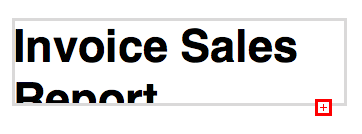

## Report Properties

### hmRep_rprop_UUID (1)
The parameter *valueText* sets the UUID of the report.

### hmRep_rprop_name (2)
The parameter *valueText* sets the name of the report.

### hmRep_rprop_pagewidth (3)
The parameter *valueLong* sets the pagewidth of the report.
*This property is obsolete in v3.0. Please use the page property. For compatibility reasons: this property sets the width of all pages. Getting this value it returns the width of the current page.*

### hmRep_rprop_pageheight (4)
The parameter *valueLong* sets the pageheight of the report.
*This property is obsolete in v3.0. Please use the page property. For compatibility reasons: this property sets the height of all pages. Getting this value it returns the height of the current page.*

### hmRep_rprop_margin_left (5)
The parameter *valueLong* sets the left margin of the report.
*This property is obsolete in v3.0. Please use the page property. For compatibility reasons: this property sets the margin of all pages. Getting this value it returns the margin of the current page.*

### hmRep_rprop_margin_top (6)
The parameter *valueLong* sets the top margin of the report.
*This property is obsolete in v3.0. Please use the page property. For compatibility reasons: this property sets the margin of all pages. Getting this value it returns the margin of the current page.*

### hmRep_rprop_margin_right (7)
The parameter *valueLong* sets the right margin of the report.
*This property is obsolete in v3.0. Please use the page property. For compatibility reasons: this property sets the margin of all pages. Getting this value it returns the margin of the current page.*

### hmRep_rprop_margin_bottom (8)
The parameter *valueLong* sets the bottom margin of the report.
*This property is obsolete in v3.0. Please use the page property. For compatibility reasons: this property sets the margin of all pages. Getting this value it returns the margin of the current page.*

### hmRep_rprop_zoom (9)
The parameter *valueLong* sets the zoom/scale factor of the current report. Pass *100* for 100 %.

### hmRep_rprop_scroll_x (10)
The parameter *valueLong* sets the offset of the horizontal scrollbar of the report.

### hmRep_rprop_scroll_y (11)
The parameter *valueLong* sets the offset of the vertical scrollbar of the report.

### hmRep_rprop_Layercounter (12)
The parameter *valueLong* sets the internal layer reference counter of the report.

### hmRep_rprop_Objectcounter (13)
The parameter *valueLong* sets the internal object reference counter of the report.

### hmRep_rprop_ShowSections (14)
*'Important: the selector is obsolete, please use [[hmRep_SET PAGE PROPERTY]] instead. The property only changes the property of the current page!*'
If *valueLong* is *1*, the report layout is reduced to the heights of all sections.

### hmRep_rprop_ShowSecCapt (15)
*'Important: the selector is obsolete, please use [[hmRep_SET PAGE PROPERTY]] instead. The property only changes the property of the current page!*'
If *valueLong* is *1*, the section captions are shown.

### hmRep_rprop_ShowSecLines (16)
*'Important: the selector is obsolete, please use [[hmRep_SET PAGE PROPERTY]] instead. The property only changes the property of the current page!*'
If *valueLong* is *1*, the section lines are shown.

### hmRep_rprop_RulerUnit (17)
The parameter *valueLong* sets the ruler to one of the units:

* 1 = Pixel
* 2 = Inch
* 3 = Millimeter

Default is *1*.

### hmRep_rprop_PageSetupSync (18)
If parameter *valueLong* is *1*: If the user changes the page settings, the reports is automatically resized to this new bounds.

### hmRep_rprop_MoveObjWithSection (19)
If the parameter *valueLong* is set to *1*, all objects under a section, will automatically moved with the section line, if the user moves the section line.

### hmRep_rprop_DefaultAntialiasing (20)
If the parameter *valueLong* is set to *1*, all new objects created by the user or programming language have antialiasing.

### hmRep_rprop_ShowPageArea (21)
**Important: the selector is obsolete, please use [[hmRep_SET PAGE PROPERTY]] instead. The property only changes the property of the current page!**
If the parameter *valueLong* is set to *1*, the report area is shown with a page frame.

### hmRep_rprop_ShowPrintableArea (22)
If the parameter *valueLong* is set to *1*, the margins are shown.

### hmRep_rprop_PrintAsReport (23)
**Important: the selector is obsolete, please use [[hmRep_SET PAGE PROPERTY]] instead. The property only changes the property of the current page!**
If the parameter *valueLong* is set to *1*, the report is printed as a report. If not, the report is printed as a page as it is, without regarding the sections.

### hmRep_rprop_ShowLayerInfo (24)
If the parameter *valueLong* is set to *1*, the layer info (a circle in layer color beside each object) will be shown. Otherwise not. The layerinfo is only shown, if more than 1 layer is available.

### hmRep_rprop_StartScript (25)
The parameter sets the startscript of the report. Pass the scriptcontent in *valueText*.
This sets plain (old) scripts only. To set a tokenized (new) script, you have to use the command [[hmRep_SET TOKENIZED SCRIPT]].
**This parameter is obsolete. To get and set the report script, you have to use the commands [[hmRep_Get Script]] and [[hmRep_SET SCRIPT]].**

### hmRep_rprop_BodyScript (26)
The parameter sets the bodyscript of the report. Pass the scriptcontent in *valueText*.
This sets plain (old) scripts only. To set a tokenized (new) script, you have to use the command [[hmRep_SET TOKENIZED SCRIPT]].
**This parameter is obsolete. To get and set the report script, you have to use the commands [[hmRep_Get Script]] and [[hmRep_SET SCRIPT]].**

### hmRep_rprop_EndScript (27)
The parameter sets the endscript of the report. Pass the scriptcontent in *valueText*.
This sets plain (old) scripts only. To set a tokenized (new) script, you have to use the command [[hmRep_SET TOKENIZED SCRIPT]].
**This parameter is obsolete. To get and set the report script, you have to use the commands [[hmRep_Get Script]] and [[hmRep_SET SCRIPT]].**

### hmRep_rprop_ShowObjectBounds (28)
If the parameter *valueLong* is set to *1*, the object outline bounds are shown. If you set the value to *0*, no frame is visible. This outline frame is only for design purposes and will be not printed out.

### hmRep_rprop_ShowVarPrefix (29)
If the parameter *valueLong* is set to *1*, the variable prefix (for example "Var:") is shown in editing mode.

### hmRep_rprop_PrintareaUseMargins (30)
If the parameter *valueLong* is set to *1*, margins are used, if you print the current report as area and not as report. The default is *0*.

### hmRep_rprop_ObjectRealloc (31)
The parameter *valueLong* sets the reallocation size for new objects. Standard is *100*. The reallocation is the buffer for creating new objects. If you create thousands of objects, it is optimized to allocate buffer for hundreds of objects instead of allocating space for each object separately. For example: if you want to create 1000 objects, it's optimized to set the reallocation size to 1000, so that hmReports internally reserves space for these objects. No byte-swapping is necessary.

### hmRep_rprop_ShowObjectOrder (32)
If the parameter *valueLong* is set to *1*, the order of objects of the current layer is visible:


If *valueLong* is *0* the order of objects is now shown. Selected objects have an order number with a red frame. Standard is *0*.

### hmRep_rprop_ShowScrollbarH (33)
If the parameter *valueLong* is set to *1*, the horizontal scrollbar of the current report is visible. Otherwise not.

### hmRep_rprop_ShowScrollbarV (34)
If the parameter *valueLong* is set to *1*, the vertical scrollbar of the current report is visible. Otherwise not.

### hmRep_rprop_PageCounter (35)
The parameter *valueLong* sets the internal page counter of the report.

### hmRep_rprop_ShowReferences (36)
If the parameter *valueLong* is *1*, references are shown in the report. If *valueLong* is *0* the current values are shown. Standard is *1*.

### hmRep_rprop_ShowGrid (37)
If the parameter *valueLong* is *1* the grid is shown, otherwise not. Standard is *0*. You can define the grid offset with the property *hmRep_rprop_GridValue*.

### hmRep_rprop_GridValue (38)
The parameter *valueLong* defines the grid size. Standard is 50 Pixels. The grid size must be at least 2 Pixels.

The following code activates a grid with a size of 10 Pixels:

```4d
 hmRep_SET REPORT PROPERTY (reparea;hmRep_rprop_ShowGrid;1;"")
 hmRep_SET REPORT PROPERTY (reparea;hmRep_rprop_GridValue;10;"")
 ```
 
 

### hmRep_rprop_UseTScriptStart (39)
The parameter *valueReal* defines, if the start script uses tokenized scripts or text based scripts. Pass *1* for using tokenized scripts, otherwise *0*. Standard is *0*.

### hmRep_rprop_UseTScriptBody (40)
The parameter *valueReal* defines, if the body script uses tokenized scripts or text based scripts. Pass *1* for using tokenized scripts, otherwise *0*. Standard is *0*.

### hmRep_rprop_UseTScriptEnd (41)
The parameter *valueReal* defines, if the end script uses tokenized scripts or text based scripts. Pass *1* for using tokenized scripts, otherwise *0*. Standard is *0*.

### hmRep_rprop_UUID_Preview (42)
The parameter *valueText* returns the UUID of the preview of the current report. If no preview exists, the result is an empty string. This property can be read only.

### hmRep_rprop_UUID_Origin (43)
The parameter *valueText* returns the UUID of the original report within a preview. The current report must be a preview, otherwise the result is an empty string. This property can be read only.

### hmRep_rprop_Closeable (44)
The parameter *valueReal* defines, if a report is closeable via the tabbar. Pass *1* for closeable or *0* for not closeable.

### hmRep_rprop_PrintOffsetH (45)
The parameter *valueReal* defines the horizontal printing offset. This can be necessary to adjust the entire page to the printer.

### hmRep_rprop_PrintOffsetV (46)
The parameter *valueReal* defines the vertical printing offset. This can be necessary to adjust the entire page to the printer.

### hmRep_rprop_ShowPagelist (47)
If the parameter *valueLong* is set to *1*, the current page list is shown of the left side of the report.

### hmRep_rprop_ShowReportViewer (48)
If the parameter *valueLong* is set to *1*, the report editor is shown.

### hmRep_rprop_ShowTextOverflow (49)
The parameter *valueLong* defines the visiblity of an icon next to the text frame, if the text doesn't fit in it.
You can use the following options:

* hmRep_ShowTextoverflow_None (default): no icon is shown
* hmRep_ShowTextoverflow_Selected: the icon is shown, if the object is selected
* hmRep_ShowTextoverflow_All: the icon is shown for all text objects

Example:
One icon, because the text doesn't fit vertically:



Two icons, because the text doesn't fit vertically and horizontally:


