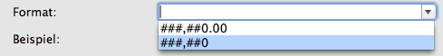

## hmRep_SET FORMAT LIST (Area ; Format list)
###### Introduced in v3, Preemptive: yes

|Parameter|Type|In/Out|Description
|---|---|:---:|---
|Area|Longint|→|hmReports area
|Format list|Text-Array|→|Array with formats

### Description
The command *hmRep_SET FORMAT LIST* sets all possible formats in the object properties:



The command fills the popup menu in the object properties dialog.
The format list is defined for the entire hmReports-area.

### Example
The following example sets all possible formats for the object properties dialog:

```4d
ARRAY TEXT($tt_formatlist;2)
$tt_formatlist{1}:="###,##0.00"
$tt_formatlist{2}:="###,##0"

hmRep_SET FORMAT LIST ($vl_area;$tt_formatlist)
 ```
