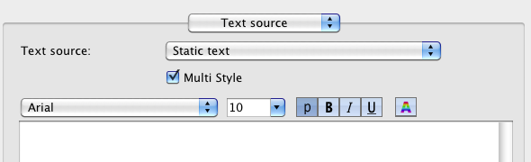
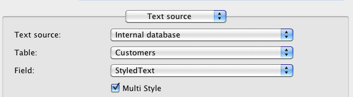

# Command overview

## Areas
### Plugin Main Commands
* [hmRep_Register (Serial number) → Error code](Areas/hmRep_Register.md)
* [hmRep_Get Version -> Version](Areas/hmRep_GetVersion.md)

### Managing Offscreen Areas
* [hmRep_New Offscreen Area (Width ; Height) → Area](Areas/hmRep_NewOffscreenArea.md)
* [hmRep_DELETE OFFSCREEN AREA (Area)](Areas/hmRep_DeleteOffscreenArea.md)

### Managing Areas
* [hmRep_Get Areas → Areas](Areas/hmRep_GetAreas.md)<span style="color:red;font-family:monospace">&nbsp;&nbsp;New in v19</span>
* [hmRep_GET AREA LIST (areas ; thread_IDs)](Areas/hmRep_GetAreaList.md)<span style="color:gray;font-family:monospace">&nbsp;&nbsp;Deprecated in v19</span>
* [hmRep_GET REPORT LIST (areas ; Report List)](Areas/hmRep_GetReportList.md)
* [hmRep_Is Area Valid (Area) → Valid](Areas/hmRep_IsAreaValid.md)<span style="color:gray;font-family:monospace">&nbsp;&nbsp;Deprecated in v19</span>
* [hmRep_Get Last Error (Area) → Error code](Areas/hmRep_GetLastError.md)
* [hmRep_SET NEW AREA FOCUSABLE (onOff)](Areas/hmRep_SetNewAreaFocusable.md)
* [hmRep_SET AUTOMATIC RELATIONS (ManyToOne ; OneToMany)](Areas/hmRep_SetAutomaticRelations.md)
* [hmRep_GET AUTOMATIC RELATIONS (ManyToOne ; OneToMany)](Areas/hmRep_GetAutomaticRelations.md)

### Callback and Events
* [hmRep_INSTALL CALLBACK (Area ; Method name)](Areas/hmRep_InstallCallback.md)
* [hmRep_Get Callback (Area) → Method name](Areas/hmRep_GetCallback.md)
* [hmRep_SET EVENT STATE (Area ; Event ; State)](Areas/hmRep_SetEventState.md)
* [hmRep_Get Event State (Area ; Event) → state](Areas/hmRep_GetEventState.md)
* [hmRep_Get Last Event (Area) → Last Event](Areas/hmRep_GetLastEvent.md)
* [hmRep_GET MOUSE (Area ; x ; y)](Areas/hmRep_GetMouse.md)
* [hmRep_SET CURSOR (Area ; CursorID ; ForceCursor)](Areas/hmRep_SetCursor.md)
* [hmRep_SET MOUSE LIMITS ( Area ; limit_h ; limit_left ; limit_right ; limit_v ; limit_top ; limit_bottom)](Areas/hmRep_SetMouseLimits.md)
* [hmRep_DRAG AND DROP PROP (Area ; Variable ; Arrayindex ; Process ; x ; y)](Areas/hmRep_DragAndDropProperties.md)

### Properties
* [hmRep_SET AREA PROPERTY (Area ; Selector ; ValueLong ; ValueText)](Areas/hmRep_SetAreaProperty.md)
* [hmRep_GET AREA PROPERTY (Area ; Selector ; ValueLong ; ValueText)](Areas/hmRep_GetAreaProperty.md)
* [hmRep_SET FONTS (Area ; Fontlist)](Areas/hmRep_SetFonts.md)
* [hmRep_GET FONTS (Area ; Fontlist)](Areas/hmRep_GetFonts.md)
* [hmRep_SET FORMAT LIST (Area ; Format list)](Areas/hmRep_SetFormatList.md)
* [hmRep_GET FORMAT LIST (Area ; Format list)](Areas/hmRep_GetFormatList.md)

### Tools
* [hmRep_SET TOOL (Area ; Tool)](Areas/hmRep_SetTool.md)
* [hmRep_Get Tool (Area) → Tool](Areas/hmRep_GetTool.md)
* [hmRep_SET TOOL VISIBLE (Area ; Tool ; Visible)](Areas/hmRep_SetToolVisible.md)
* [hmRep_Get Tool Visible (Area ; Tool) → Visible](Areas/hmRep_GetToolVisible.md)
* [hmRep_SET TOOL TIP TEXT (Area ; Tool ; Tiptext)](Areas/hmRep_SetToolTipText.md)
* [hmRep_Get Tool Tip Text (Area ; Tool) → Tiptext](Areas/hmRep_GetToolTipText.md)
* [hmRep_Get Barcode List → Barcodes](Areas/hmRep_GetBarcodeList.md)

## Reports
### Managing Reports
* [hmRep_Create Report (Area ; Width ; Height ; Name) → Report UUID](Reports/hmRep_CreateReport.md)
* [hmRep_DELETE REPORT (Area ; report UUID)](Reports/hmRep_DeleteReport.md)
* [hmRep_CLEAR REPORT (Area)](Reports/hmRep_ClearReport.md)
* [hmRep_SET CURRENT REPORT (Area ; Report UUID)](Reports/hmRep_SetCurrentReport.md)
* [hmRep_Get Current Report (Area) → report UUID](Reports/hmRep_GetCurrentReport.md)
* [hmRep_REPORT TO BLOB ( Area ; Blob)](Reports/hmRep_ReportToBlob.md)
* [hmRep_BLOB TO REPORT ( Area ; Type ; Blob)](Reports/hmRep_BlobToReport.md)
* [hmRep_SET COLOR WITH ALPHA ( Area ; Selector ; id ; Red ; Green ; Blue ; Alpha)](Reports/hmRep_SetColorWithAlpha.md)
* [hmRep_GET COLOR WITH ALPHA ( Area ; Selector ; id ; Red ; Green ; Blue ; Alpha)](Reports/hmRep_GetColorWithAlpha.md)
* [hmRep_Pixel To Rulerunit ( Area ; Pixel) → Ruler unit](Reports/hmRep_RulerunitToPixel.md)
* [hmRep_Rulerunit To Pixel ( Area ; Ruler unit) → Pixel](Reports/hmRep_RulerunitToPixel.md)
* [hmRep_GET REPORT DEPENDENCIES ( Area ; scopeArray ; scopeIDArray ; UUIDArray)](Reports/hmRep_GetReportDependencies.md)
* [hmRep_SET DIALOG RECT (Area ; Type ; Left ; Top ; Right ; Bottom)](Reports/hmRep_SetDialogRect.md)
* [hmRep_GET DIALOG RECT (Area ; Type ; Left ; Top ; Right ; Bottom)](Reports/hmRep_GetDialogRect.md)

### Properties
* [hmRep_SET REPORT PROPERTY (Area ; Selector ; ValueLong ; ValueText)](Reports/hmRep_SetReportProperty.md)
* [hmRep_GET REPORT PROPERTY (Area ; Selector ; ValueLong ; ValueText)](Reports/hmRep_GetReportProperty.md)
* [hmRep_SET SCALE (Area ; Scale)](Reports/hmRep_SetScale.md)
* [hmRep_Get Scale (Area) -> Scale](Reports/hmRep_GetScale.md)
* [hmRep_ZOOM TO RECT (Area ; Left ; Top ; Right ; Bottom)](Reports/hmRep_ZoomToRect.md)
* [hmRep_Enumerate Pages (Area) → Result](Reports/hmRep_EnumeratePages.md)

### Input/Output
* [hmRep_Report To Picture ( Area ; Format ; dpiX ; dpiY) → Picture](Reports/hmRep_ReportToPicture.md)
* [hmRep_REPORT TO SVG ( Area ; Blob)](Reports/hmRep_ReportToSVG.md)
* [hmRep_RENDER TO PICTURE ( Area ; picArray ; Format ; Limit ; dpiX ; dpiY)](Reports/hmRep_RenderToPicture.md)
* [hmRep_Render To Text ( Area ; Options ; FieldDelim ; RecordDelim) → Text](Reports/hmRep_RenderToText.md)
* [hmRep_Render To HTML ( Area ; Options) → Text](Reports/hmRep_RenderToHTML.md)
* [hmRep_Render To Blob ( Area ; Charset ; Options ; FieldDelim ; RecordDelim) → Result](Reports/hmRep_RenderToBlob.md)<span style="color:gray;font-family:monospace">&nbsp;&nbsp;Deprecated in v19</span>
* [hmRep_GET IMPORT PROTOCOLL ( Area ; Protocoll)](Reports/hmRep_GetImportProtocoll.md)

## Pages
### Overview
A report can have multiple pages. Each page can printed as it is or each page can printed as a report. So every page can be an independent report with its own iterations and sections. So it is possible to have a static page as a first page, followed by a report.

### Page numeration
Each page have a continuous number from the first page to the last page. Also, hmReports give each page an ID which is unique. This is helpful, because you can always refer to a page after the user deletes/adds pages. If the user deletes/inserts pages, the page number of a page may differ. The ID of a page does never change.

### Creating pages
* [hmRep_INSERT PAGE ( Area ; afterPage)](Pages/hmRep_InsertPage.md)

### Copy and paste entire pages
* [hmRep_SET PAGE ( Area ; afterPage ; pageblob)](Pages/hmRep_SetPage.md)
* [hmRep_GET PAGE ( Area ; afterPage ; pageblob)](Pages/hmRep_GetPage.md)

### Getting/setting information about pages
* [hmRep_SET PAGE PROPERTY ( Area ; pageNo ; Selector ; valueLong ; valueText)](Pages/hmRep_SetPageProperty.md)
* [hmRep_GET PAGE PROPERTY ( Area ; pageNo ; Selector ; valueLong ; valueText)](Pages/hmRep_GetPageProperty.md)

### Getting/setting the current page of the current report
* [hmRep_SET CURRENT PAGE ( Area ; pageNo )](Pages/hmRep_SetCurrentPage.md)
* [hmRep_Get Current Page ( Area ) → pageNo)](Pages/hmRep_GetCurrentPage.md)

### Enumerating pages
* [hmRep_Count Pages ( Area ) → pages](Pages/hmRep_CountPages.md)

### Conversion between page number and reference
* [hmRep_Get Page Number From ID ( Area ; pageID) → number](Pages/hmRep_GetPageNumberFromID.md)
* [hmRep_Get Page ID From Number ( Area ; number) → pageID](Pages/hmRep_GetPageIDFromNumber.md)

### Deleting pages
* [hmRep_DELETE PAGE ( Area ; pageNo)](Pages/hmRep_DeletePage.md)

## Layers

### Creating layers
* [hmRep_Create Layer ( Area ; layername) → ID](Layers/hmRep_CreateLayer.md)

### List all layers
* [hmRep_GET LAYER LIST ( Area ; arrayID ; arrayNames)](Layers/hmRep_GetLayerList.md)

### Getting/setting information about layers
* [hmRep_SET LAYER PROPERTY ( Area ; ID ; Selector ; valueLong ; valueText)](Layers/hmRep_SetLayerProperty.md)
* [hmRep_GET LAYER PROPERTY ( Area ; ID ; Selector ; valueLong ; valueText)](Layers/hmRep_GetLayerProperty.md)
* [hmRep_SET LAYER CLIP ( Area; ID ; Left ; Top ; Right ; Bottom )](Layers/hmRep_SetLayerClip.md)
* [hmRep_GET LAYER CLIP ( Area; ID ; Left ; Top ; Right ; Bottom )](Layers/hmRep_GetLayerClip.md)

### Getting/setting the current layer of the current report
* [hmRep_SET CURRENT LAYER ( Area ; ID)](Layers/hmRep_SetCurrentLayer.md)
* [hmRep_Get Current Layer ( Area ) → ID](Layers/hmRep_GetCurrentLayer.md)

### Sort layers
* [hmRep_SORT LAYER ( Area ; ID ; orderNumber)](Layers/hmRep_SortLayer.md)

### Deleting layers
* [hmRep_DELETE LAYER ( Area ; ID)](Layers/hmRep_DeleteLayer.md)

## Guides
* [hmRep_Create Guide ( Area ; horizontal ; position ; page) → number](Guides/hmRep_CreateGuide.md)
* [hmRep_Count Guides ( Area ) → guides](Guides/hmRep_CountGuides.md)
* [hmRep_DELETE GUIDE ( Area ; Number)](Guides/hmRep_DeleteGuide.md)
* [hmRep_SET GUIDES ( Area ; ArrayH ; ArrayV)](Guides/hmRep_SetGuides.md)
* [hmRep_GET GUIDES ( Area ; ArrayH ; ArrayV)](Guides/hmRep_GetGuides.md)
* [hmRep_SET GUIDE PROPERTY ( Area ; Number ; Selector ; valueLong ; valueText)](Guides/hmRep_SetGuideProperty.md)
* [hmRep_GET GUIDE PROPERTY ( Area ; Number ; Selector ; valueLong ; valueText)](Guides/hmRep_GetGuideProperty.md)

## Printing
* [hmRep_Print ( Area ; Options) -> result](Printing/hmRep_Print.md)
* [hmRep_Page Setup ( Area ; Dialogs) → result](Printing/hmRep_PageSetup.md)
* [hmRep_Print settings to BLOB ( Area ) → print header](Printing/hmRep_PrintsettingsToBlob.md)
* [hmRep_BLOB TO PRINT SETTINGS ( Area ; print header)](Printing/hmRep_BlobToPrintsettings.md)
* [hmRep_SET PRINT OPTION ( Area ; Option ; Value1 ; Value2 ; Value3)](Printing/hmRep_SetPrintOption.md)
* [hmRep_GET PRINT OPTION ( Area ; option ; value1 ; value2 ; value3)](Printing/hmRep_GetPrintOption.md)
* [hmRep_GET PAPER SIZE ( Paper type ; Orientation ; Width ; Height)](Printing/hmRep_GetPaperSize.md)
* [hmRep_GET RENDER LOG ( Area ; arrayType ; arrayRef1 ; arrayRef2 ; arrayRef3 ; arrayInOut)](Printing/hmRep_GetRenderLog.md)
* [hmRep_Get Native Print Header ( Area ; Type ) → print header](Printing/hmRep_GetNativePrintHeader.md)
* [hmRep_SET NATIVE PRINT HEADER ( Area ; Type ; Print Header)](Printing/hmRep_SetNativePrintHeader.md)
* [hmRep_OPEN PRINTING JOB ( Area ; Options)](Printing/hmRep_OpenPrintJob.md)
* [hmRep_CLOSE PRINTING JOB ( Area )](Printing/hmRep_ClosePrintJob.md)

## Sections
### Getting information about sections
* [hmRep_GET SECTIONS ( Area ; SectionTypes ; SectionHeights ; SectionCount)](Sections/hmRep_GetSections.md)
* [hmRep_GET SECTION ITERATION ( Area ; Section ; Type ; valueLong ; valueText)](Sections/hmRep_GetSectionIteration.md)
* [hmRep_GET SECTION PROPERTY ( Area ; Type ; Count ; Selector ; valueLong ; valueText)](Sections/hmRep_GetSectionProperty.md)
* [hmRep_Get Section Count ( Area ; Type) → Count](Sections/hmRep_GetSectionCount.md)

### Set section properties
* [hmRep_SET SECTION ITERATION ( Area ; Section ; Type ; valueLong ; valueText)](Sections/hmRep_SetSectionIteration.md)
* [hmRep_SET SECTION HEIGHT ( Area ; Type ; Count ; Height)](Sections/hmRep_SetSectionHeight.md)
* [hmRep_SET SECTION COUNT ( Area ; Type ; Count)](Sections/hmRep_SetSectionCount.md)
* [hmRep_SET SECTION PROPERTY ( Area ; Type ; Count ; Selector ; valueLong ; valueText)](Sections/hmRep_SetSectionProperty.md)

### Find a section by a coordinate
* [hmRep_GET SECTION BY POINT ( Area ; Mousex ; Mousey ; Type ; Count)](Sections/hmRep_GetSectionByPoint.md)

### Order sections
* [hmRep_ORDER SECTIONS ( Area ; sectionTypes ; sectionCount)](Sections/hmRep_OrderSections.md)

## Objects
### Creating Objects
* [hmRep_Create Rectangle ( Area ; left ; top ; right ; bottom) → object ID](Objects/hmRep_CreateRectangle.md)
* [hmRep_Create Round Rectangle ( Area ; left ; top ; right ; bottom ; rounding) → object ID](Objects/hmRep_CreateRoundRectangle.md)
* [hmRep_Create Text ( Area ; left ; top ; right ; bottom ; text) → object ID](Objects/hmRep_CreateText.md)
* [hmRep_Create Oval ( Area ; left ; top ; right ; bottom) → object ID](Objects/hmRep_CreateOval.md)
* [hmRep_Create Line ( Area ; left ; top ; right ; bottom) → object ID](Objects/hmRep_CreateLine.md)
* [hmRep_Create Picture ( Area ; left ; top ; right ; bottom) → object ID](Objects/hmRep_CreatePicture.md)
* [hmRep_Create Group ( Area ; objects) → object ID](Objects/hmRep_CreateGroup.md)
* [hmRep_Create Arc ( Area ; x ; y ; radiusx ; radiusy ; startAngle ; endAngle ; clockwise) → object ID](Objects/hmRep_CreateArc.md)
* [hmRep_Create Freehand ( Area ; array_x ; array_y) → object ID](Objects/hmRep_CreateFreehand.md)
* [hmRep_Create Subreport ( Area ; left ; top ; right ; bottom ; subreportUUID) → object ID](Objects/hmRep_CreateSubreport.md)
* [hmRep_SET OBJECTS ( Area ; objectblob)](hmRep_SetObjects.md)
* [hmRep_GET OBJECTS ( Area ; objectblob)](hmRep_GetObjects.md)

### Paths
* [hmRep_SET PATH ( Area ; object ID ; path)](Objects/hmRep_SetPath.md)
* [hmRep_PATH POINT ( Area ; x ; y)](Objects/hmRep_PathPoint.md)
* [hmRep_PATH MOVE TO ( Area ; x ;y)](Objects/hmRep_PathMoveTo.md)
* [hmRep_PATH CURVE ( Area ; cp1x ; cp1y ; cp2x ; cp2y ; x ; y)](Objects/hmRep_PathCurve.md)
* [hmRep_CLOSE PATH ( Area )](Objects/hmRep_ClosePath.md)
* [hmRep_End Path ( Area ) → object ID](Objects/hmRep_EndPath.md)
* [hmRep_GET PATH INFORMATION ( Area ; object ID ; array_type ; array_x ; array_y ; array_cp1x ; array_cp1y ; array_cp2x ; array_cp2y)](Objects/hmRep_GetPathInformation.md)
* [hmRep_SET PATH ( Area ; object ID ; path)](Objects/hmRep_SetPath.md)
* [hmRep_Get Path ( Area ; object ID) → Path text](Objects/hmRep_GetPath.md)

### Deleting Objects
* [hmRep_DELETE OBJECT ( Area ; objectID ; deleteGroupObjects)](Objects/hmRep_DeleteObject.md)
* [hmRep_DELETE OBJECTS ( Area ; scope ; scopeID)](Objects/hmRep_DeleteObjects.md)

### Object Properties
* [hmRep_SET OBJECT PROPERTY ( Area ; id ; selector ; valueReal ; valueText)](Objects/hmRep_SetObjectProperty.md)
* [hmRep_GET OBJECT PROPERTY ( Area ; id ; selector ; valueReal ; valueText)](Objects/hmRep_GetObjectProperty.md)
* [hmRep_GET OBJECT LIST( Area ; scope ; scopeID ; arrayIDs)](Objects/hmRep_GetObjectList.md)
* [hmRep_GET OBJECTS BY POINT ( Area ; x ; y ; arrayIDs)](Objects/hmRep_GetObjectsByPoint.md)
* [hmRep_GET OBJECTS BY RECT ( Area ; layerID ; left ; top ; right ; bottom ; searchInGroups ; arrayIDs)](Objects/hmRep_GetObjectsByRect.md)
* [hmRep_SET PICTURE( Area ; ID ; picture)](Objects/hmRep_SetPicture.md)
* [hmRep_GET PICTURE( Area ; ID ; picture)](Objects/hmRep_GetPicture.md)
* [hmRep_GET OBJECT RECT ( Area ; objectID ; left ; top ; right ; bottom)](Objects/hmRep_GetObjectRect.md)
* [hmRep_SET OBJECT RECT ( Area ; objectID ; left ; top ; right ; bottom)](Objects/hmRep_SetObjectRect.md)
* [hmRep_SELECT OBJECTS ( Area ; objectArray ; operation)](hmRep_SelectObjects.md)
* [hmRep_SET OBJECT DATA ( Area ; objectID ; dataType ; database ; table ; field ; variablename ; arrayindex)](Objects/hmRep_SetObjectData.md)
* [hmRep_GET OBJECT DATA ( Area ; objectID ; dataType ; database ; table ; field ; variablename ; arrayindex)](Objects/hmRep_GetObjectData.md)
* [hmRep_UPDATE SUBREPORTS ( Area )](Objects/hmRep_UpdateSubreports.md)
* [hmRep_SET OBJECT LINEDASH ( Area ; objectID ; phase ; arrayDashes)](Objects/hmRep_SetObjectLineDash.md)
* [hmRep_GET OBJECT LINEDASH ( Area ; objectID ; phase ; arrayDashes)](Objects/hmRep_GetObjectLineDash.md)
* [hmRep_SET RECT COLUMNS ( Area ; objectID ; columnsArray)](Objects/hmRep_SetRectColumns.md)
* [hmRep_GET RECT COLUMNS ( Area ; objectID ; columnsArray)](Objects/hmRep_GetRectColumns.md)
* [hmRep_SET RECT ROWS ( Area ; objectID ; rowsArray)](Objects/hmRep_SetRectRows.md)
* [hmRep_GET RECT ROWS ( Area ; objectID ; rowsArray)](Objects/hmRep_GetRectRows.md)

## Scripting
### Overview
A hmReports  Area  has it's own variable stack. It's a sandbox concept where you can put any variable you want into the  Area . It does not intersects the variable name space of 4D. More information can be found in the chapter [[Script Execution]].

### hmX
Plugin functions which starting with the prefix "hmX" are going directly on the executer/interpreter. They are indepently from the hmReports area. 

### Managing variable stack
* [hmRep_SET VARIABLE ( Area ; varname ; vartype ; valuetext ; valuenum ; valuedate)](Scripting/hmRep_SetVariable.md)
* [hmRep_GET VARIABLE ( Area ; varname ; vartype ; valuetext ; valuenum ; valuedate)](Scripting/hmRep_GetVariable.md)
* [hmRep_SET ARRAY ( Area ; varname ; array)](Scripting/hmRep_SetArray.md)
* [hmRep_GET ARRAY ( Area ; varname ; array)](Scripting/hmRep_GetArray.md)
* [hmRep_SET ARRAY ELEMENT ( Area ; varname ; arrayindex ; valuetext ; valuenum ; valuedate)](Scripting/hmRep_SetArrayElement.md)
* [hmRep_GET ARRAY ELEMENT ( Area ; varname ; arrayindex ; valuetext ; valuenum ; valuedate)](Scripting/hmRep_GetArrayElement.md)
* [hmRep_SET VARIABLE OBJECT ( Area ; varname ; object)](Scripting/hmRep_SetVariableObject.md)<span style="color:red;font-family:monospace">&nbsp;&nbsp;New in v19</span>
* [hmRep_GET VARIABLE LIST ( Area ; arrayNames)](Scripting/hmRep_GetVariableList.md)
* [hmRep_DELETE VARIABLE ( Area ; varname)](Scripting/hmRep_DeleteVariable.md)

### Managing Methods
* [hmRep_CREATE METHOD ( Area ; methodname ; script)](Scripting/hmRep_CreateMethod.md)
* [hmRep_DELETE METHOD ( Area ; methodname)](Scripting/hmRep_DeleteMethod.md)
* [hmRep_GET METHOD LIST ( Area ; list)](Scripting/hmRep_GetMethodList.md)
* [hmRep_SET METHOD( Area ; methodname ; script)](Scripting/hmRep_SetMethod.md)
* [hmRep_Get Method ( Area ; methodname) → script](Scripting/hmRep_GetMethod.md)

### Getting information about script variables
* [hmRep_GET VARS FROM SCRIPTS ( Area ; listtype ; arrayNames ; arrayTypes)](Scripting/hmRep_GetVarsFromScripts.md)

### Managing Scripts
* [hmRep_SET TOKENIZED SCRIPT ( Area ; selector ; id ; script)](Scripting/hmRep_SetTokenizedScript.md)
* [hmRep_GET TOKENIZED SCRIPT ( Area ; selector ; id ; script)](Scripting/hmRep_GetTokenizedScript.md)
* [hmRep_Is Old Script ( Area ) → isOld](Scripting/hmRep_IsOldScript.md)

### Tokenize/detokenize scripts
* [hmRep_TOKENIZE ( Area ; methodtext ; script)](Scripting/hmRep_Tokenize.md)
* [hmRep_Detokenize ( Area ; script) → method text](Scripting/hmRep_Detokenize.md)

### Scripts syntax coloring
* [hmX_SET 4D CODE STYLE]
* [hmX_GET 4D CODE STYLE]
* [hmX_Count 4D Code Styles]

## Styled text
### Overview
hmReports does support styled text for text objects. You can edit rich text in the object properties, if you enable the *Multi Style* property:



### Runs
Runs are definitions from which position to which position of the text runs a style. If text positions have no run, the default text style is used (defined by [hmRep_SET OBJECT PROPERTY](Objects/hmRep_SetObjectProperty.md)).

Runs should not overlap other runs; this may have unwanted results.

You can create runs with the command [hmRep_CREATE STYLED TEXT RUN](StyledText/hmRep_CreateStyledTextRun.md). With the commands [hmRep_Count Runs](StyledText/hmRep_CountRuns.md) and [hmRep_GET STYLED TEXT RUN](StyledText/hmRep_GetStyledTextRun.md) you can loop through existing commands of an object.

With [hmRep_DELETE ALL RUNS](StyledText/hmRep_DeleteAllRuns.md) you can delete all existing runs of an object.

### 4D Styled Text Tags
4D internally uses styled tags to save styled text into text fields and variables. A styled text looks in 4D like:

```4d
<SPAN STYLE="font-family:'Arial';font-size:10pt;text-align:left;font-weight:normal;font-style:normal;text-decoration:none;color:#000000">This is
```
Every *SPAN STYLE* is a run in hmReports. You can use the command [hmRep_SET STYLED TEXT](StyledText/hmRep_SetStyledText.md) to set this 4D styled text into hmReports. hmReports automatically convert the string into runs and extract the raw text.

### Multistyle in Variables, Fields and Arrays

If you use a text field, text variable or text array as a reference, you can turn on the *Multi Style* flag, if you want hmReports interpret the content as rich text:



### Commands
* [hmRep_CREATE STYLED TEXT RUN ( Area ; objectID ; from ; to ; fontname ; fontsize ; fontstyle ; red ; green ; blue ; alpha ; back-red ; back-green ; back-blue ; back-alpha)](StyledText/hmRep_CreateStyledTextRun.md)
* [hmRep_GET STYLED TEXT RUN ( Area ; objectID ; number ; from ; to ; fontname ; fontsize ; fontstyle ; red ; green ; blue ; alpha ; back-red ; back-green ; back-blue ; back-alpha)](StyledText/hmRep_GetStyledTextRun.md)
* [hmRep_SET STYLED TEXT ( Area ; objectID ; styledtext)](StyledText/hmRep_SetStyledText.md)
* [hmRep_Get Styled Text ( Area ; objectID) → styledtext](StyledText/hmRep_GetStyledText.md)
* [hmRep_Count Runs ( Area ; objectID) → count](StyledText/hmRep_CountRuns.md)
* [hmRep_DELETE ALL RUNS ( Area ; objectID)](StyledText/hmRep_DeleteAllRuns.md)

---

## Appendix
* [Area Properties](Appendix/AreaProperties.md)
* [Report Properties](Appendix/ReportProperties.md)
* [Object Properties](Appendix/ObjectProperties.md)
* [Path types](Appendix/PathTypes.md)
* [Object types](Appendix/ObjectTypes.md)
* [Picture types](Appendix/PictureTypes.md)
* [Gradient types](Appendix/GradientTypes.md)
* [Page Properties](Appendix/PageProperties.md)
* [Layer Properties](Appendix/LayerProperties.md)
* [Guide Properties](Appendix/GuideProperties.md)
* [Tools](Appendix/Tools.md)
* [Iteration Types](Appendix/IterationTypes.md)
* [Section Properties](Appendix/SectionProperties.md)
* [Section Types](Appendix/SectionTypes.md)
* [Section Break Types](Appendix/SectionBreakTypes.md)
* [Section Visible Types](Appendix/SectionVisibleTypes.md)
* [Colors](Appendix/Colors.md)
* [Import Types](Appendix/ImportTypes.md)
* [Dialog types](Appendix/DialogTypes.md)
* [Error Codes](Appendix/ErrorCodes.md)
