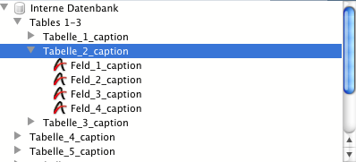
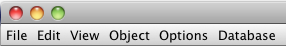
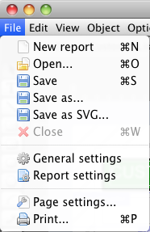

# Command overview

## [Areas](#areas)
### Plugin Main Commands
* [hmRep_Register (Serial number) → Error code](Areas/hmRep_Register.md)
* [hmRep_Get Version -> Version](Areas/hmRep_GetVersion.md)

### Managing Offscreen Areas
* [hmRep_New Offscreen Area (Width ; Height) → Area](Areas/hmRep_NewOffscreenArea.md)
* [hmRep_DELETE OFFSCREEN AREA (Area)](Areas/hmRep_DeleteOffscreenArea.md)

### Managing Areas
* [hmRep_Get Areas → Areas](Areas/hmRep_GetAreas.md)<span style="color:red;font-family:monospace">&nbsp;&nbsp;New in v19</span>
* [hmRep_GET AREA LIST (areas ; thread_IDs)](Areas/hmRep_GetAreaList.md)<span style="color:gray;font-family:monospace">&nbsp;&nbsp;Deprecated in v19</span>
* [hmRep_GET REPORT LIST (areas ; Report List)](Areas/hmRep_GetReportList.md)
* [hmRep_Is Area Valid (Area) → Valid](Areas/hmRep_IsAreaValid.md)<span style="color:gray;font-family:monospace">&nbsp;&nbsp;Deprecated in v19</span>
* [hmRep_Get Last Error (Area) → Error code](Areas/hmRep_GetLastError.md)
* [hmRep_SET NEW AREA FOCUSABLE (onOff)](Areas/hmRep_SetNewAreaFocusable.md)
* [hmRep_SET AUTOMATIC RELATIONS (ManyToOne ; OneToMany)](Areas/hmRep_SetAutomaticRelations.md)
* [hmRep_GET AUTOMATIC RELATIONS (ManyToOne ; OneToMany)](Areas/hmRep_GetAutomaticRelations.md)

### Callback and Events
* [hmRep_INSTALL CALLBACK (Area ; Method name)](Areas/hmRep_InstallCallback.md)
* [hmRep_Get Callback (Area) → Method name](Areas/hmRep_GetCallback.md)
* [hmRep_SET EVENT STATE (Area ; Event ; State)](Areas/hmRep_SetEventState.md)
* [hmRep_Get Event State (Area ; Event) → state](Areas/hmRep_GetEventState.md)
* [hmRep_Get Last Event (Area) → Last Event](Areas/hmRep_GetLastEvent.md)
* [hmRep_GET MOUSE (Area ; x ; y)](Areas/hmRep_GetMouse.md)
* [hmRep_SET CURSOR (Area ; CursorID ; ForceCursor)](Areas/hmRep_SetCursor.md)
* [hmRep_SET MOUSE LIMITS ( Area ; limit_h ; limit_left ; limit_right ; limit_v ; limit_top ; limit_bottom)](Areas/hmRep_SetMouseLimits.md)
* [hmRep_DRAG AND DROP PROP (Area ; Variable ; Arrayindex ; Process ; x ; y)](Areas/hmRep_DragAndDropProperties.md)

### Properties
* [hmRep_SET AREA PROPERTY (Area ; Selector ; ValueLong ; ValueText)](Areas/hmRep_SetAreaProperty.md)
* [hmRep_GET AREA PROPERTY (Area ; Selector ; ValueLong ; ValueText)](Areas/hmRep_GetAreaProperty.md)
* [hmRep_SET FONTS (Area ; Fontlist)](Areas/hmRep_SetFonts.md)
* [hmRep_GET FONTS (Area ; Fontlist)](Areas/hmRep_GetFonts.md)
* [hmRep_SET FORMAT LIST (Area ; Format list)](Areas/hmRep_SetFormatList.md)
* [hmRep_GET FORMAT LIST (Area ; Format list)](Areas/hmRep_GetFormatList.md)

### Tools
* [hmRep_SET TOOL (Area ; Tool)](Areas/hmRep_SetTool.md)
* [hmRep_Get Tool (Area) → Tool](Areas/hmRep_GetTool.md)
* [hmRep_SET TOOL VISIBLE (Area ; Tool ; Visible)](Areas/hmRep_SetToolVisible.md)
* [hmRep_Get Tool Visible (Area ; Tool) → Visible](Areas/hmRep_GetToolVisible.md)
* [hmRep_SET TOOL TIP TEXT (Area ; Tool ; Tiptext)](Areas/hmRep_SetToolTipText.md)
* [hmRep_Get Tool Tip Text (Area ; Tool) → Tiptext](Areas/hmRep_GetToolTipText.md)
* [hmRep_Get Barcode List → Barcodes](Areas/hmRep_GetBarcodeList.md)

## [Reports](#reports)
### Managing Reports
* [hmRep_Create Report (Area ; Width ; Height ; Name) → Report UUID](Reports/hmRep_CreateReport.md)
* [hmRep_DELETE REPORT (Area ; report UUID)](Reports/hmRep_DeleteReport.md)
* [hmRep_CLEAR REPORT (Area)](Reports/hmRep_ClearReport.md)
* [hmRep_SET CURRENT REPORT (Area ; Report UUID)](Reports/hmRep_SetCurrentReport.md)
* [hmRep_Get Current Report (Area) → report UUID](Reports/hmRep_GetCurrentReport.md)
* [hmRep_REPORT TO BLOB ( Area ; Blob)](Reports/hmRep_ReportToBlob.md)
* [hmRep_BLOB TO REPORT ( Area ; Type ; Blob)](Reports/hmRep_BlobToReport.md)
* [hmRep_SET COLOR WITH ALPHA ( Area ; Selector ; id ; Red ; Green ; Blue ; Alpha)](Reports/hmRep_SetColorWithAlpha.md)
* [hmRep_GET COLOR WITH ALPHA ( Area ; Selector ; id ; Red ; Green ; Blue ; Alpha)](Reports/hmRep_GetColorWithAlpha.md)
* [hmRep_Pixel To Rulerunit ( Area ; Pixel) → Ruler unit](Reports/hmRep_RulerunitToPixel.md)
* [hmRep_Rulerunit To Pixel ( Area ; Ruler unit) → Pixel](Reports/hmRep_RulerunitToPixel.md)
* [hmRep_GET REPORT DEPENDENCIES ( Area ; scopeArray ; scopeIDArray ; UUIDArray)](Reports/hmRep_GetReportDependencies.md)
* [hmRep_SET DIALOG RECT (Area ; Type ; Left ; Top ; Right ; Bottom)](Reports/hmRep_SetDialogRect.md)
* [hmRep_GET DIALOG RECT (Area ; Type ; Left ; Top ; Right ; Bottom)](Reports/hmRep_GetDialogRect.md)

### Properties
* [hmRep_SET REPORT PROPERTY (Area ; Selector ; ValueLong ; ValueText)](Reports/hmRep_SetReportProperty.md)
* [hmRep_GET REPORT PROPERTY (Area ; Selector ; ValueLong ; ValueText)](Reports/hmRep_GetReportProperty.md)
* [hmRep_SET SCALE (Area ; Scale)](Reports/hmRep_SetScale.md)
* [hmRep_Get Scale (Area) -> Scale](Reports/hmRep_GetScale.md)
* [hmRep_ZOOM TO RECT (Area ; Left ; Top ; Right ; Bottom)](Reports/hmRep_ZoomToRect.md)
* [hmRep_Enumerate Pages (Area) → Result](Reports/hmRep_EnumeratePages.md)

### Input/Output
* [hmRep_Report To Picture ( Area ; Format ; dpiX ; dpiY) → Picture](Reports/hmRep_ReportToPicture.md)
* [hmRep_REPORT TO SVG ( Area ; Blob)](Reports/hmRep_ReportToSVG.md)
* [hmRep_RENDER TO PICTURE ( Area ; picArray ; Format ; Limit ; dpiX ; dpiY)](Reports/hmRep_RenderToPicture.md)
* [hmRep_Render To Text ( Area ; Options ; FieldDelim ; RecordDelim) → Text](Reports/hmRep_RenderToText.md)
* [hmRep_Render To HTML ( Area ; Options) → Text](Reports/hmRep_RenderToHTML.md)
* [hmRep_Render To Blob ( Area ; Charset ; Options ; FieldDelim ; RecordDelim) → Result](Reports/hmRep_RenderToBlob.md)<span style="color:gray;font-family:monospace">&nbsp;&nbsp;Deprecated in v19</span>
* [hmRep_GET IMPORT PROTOCOLL ( Area ; Protocoll)](Reports/hmRep_GetImportProtocoll.md)

## [Pages](#pages)
### Overview
A report can have multiple pages. Each page can printed as it is or each page can printed as a report. So every page can be an independent report with its own iterations and sections. So it is possible to have a static page as a first page, followed by a report.

### Page numeration
Each page have a continuous number from the first page to the last page. Also, hmReports give each page an ID which is unique. This is helpful, because you can always refer to a page after the user deletes/adds pages. If the user deletes/inserts pages, the page number of a page may differ. The ID of a page does never change.

### Creating pages
* [hmRep_INSERT PAGE ( Area ; afterPage)](Pages/hmRep_InsertPage.md)

### Copy and paste entire pages
* [hmRep_SET PAGE ( Area ; afterPage ; pageblob)](Pages/hmRep_SetPage.md)
* [hmRep_GET PAGE ( Area ; afterPage ; pageblob)](Pages/hmRep_GetPage.md)

### Getting/setting information about pages
* [hmRep_SET PAGE PROPERTY ( Area ; pageNo ; Selector ; valueLong ; valueText)](Pages/hmRep_SetPageProperty.md)
* [hmRep_GET PAGE PROPERTY ( Area ; pageNo ; Selector ; valueLong ; valueText)](Pages/hmRep_GetPageProperty.md)

### Getting/setting the current page of the current report
* [hmRep_SET CURRENT PAGE ( Area ; pageNo )](Pages/hmRep_SetCurrentPage.md)
* [hmRep_Get Current Page ( Area ) → pageNo)](Pages/hmRep_GetCurrentPage.md)

### Enumerating pages
* [hmRep_Count Pages ( Area ) → pages](Pages/hmRep_CountPages.md)

### Conversion between page number and reference
* [hmRep_Get Page Number From ID ( Area ; pageID) → number](Pages/hmRep_GetPageNumberFromID.md)
* [hmRep_Get Page ID From Number ( Area ; number) → pageID](Pages/hmRep_GetPageIDFromNumber.md)

### Deleting pages
* [hmRep_DELETE PAGE ( Area ; pageNo)](Pages/hmRep_DeletePage.md)

## [Layers](#layers)

### Creating layers
* [hmRep_Create Layer ( Area ; layername) → ID](Layers/hmRep_CreateLayer.md)

### List all layers
* [hmRep_GET LAYER LIST ( Area ; arrayID ; arrayNames)](Layers/hmRep_GetLayerList.md)

### Getting/setting information about layers
* [hmRep_SET LAYER PROPERTY ( Area ; ID ; Selector ; valueLong ; valueText)](Layers/hmRep_SetLayerProperty.md)
* [hmRep_GET LAYER PROPERTY ( Area ; ID ; Selector ; valueLong ; valueText)](Layers/hmRep_GetLayerProperty.md)
* [hmRep_SET LAYER CLIP ( Area; ID ; Left ; Top ; Right ; Bottom )](Layers/hmRep_SetLayerClip.md)
* [hmRep_GET LAYER CLIP ( Area; ID ; Left ; Top ; Right ; Bottom )](Layers/hmRep_GetLayerClip.md)

### Getting/setting the current layer of the current report
* [hmRep_SET CURRENT LAYER ( Area ; ID)](Layers/hmRep_SetCurrentLayer.md)
* [hmRep_Get Current Layer ( Area ) → ID](Layers/hmRep_GetCurrentLayer.md)

### Sort layers
* [hmRep_SORT LAYER ( Area ; ID ; orderNumber)](Layers/hmRep_SortLayer.md)

### Deleting layers
* [hmRep_DELETE LAYER ( Area ; ID)](Layers/hmRep_DeleteLayer.md)

## [Guides](#guides)
* [hmRep_Create Guide ( Area ; horizontal ; position ; page) → number](Guides/hmRep_CreateGuide.md)
* [hmRep_Count Guides ( Area ) → guides](Guides/hmRep_CountGuides.md)
* [hmRep_DELETE GUIDE ( Area ; Number)](Guides/hmRep_DeleteGuide.md)
* [hmRep_SET GUIDES ( Area ; ArrayH ; ArrayV)](Guides/hmRep_SetGuides.md)
* [hmRep_GET GUIDES ( Area ; ArrayH ; ArrayV)](Guides/hmRep_GetGuides.md)
* [hmRep_SET GUIDE PROPERTY ( Area ; Number ; Selector ; valueLong ; valueText)](Guides/hmRep_SetGuideProperty.md)
* [hmRep_GET GUIDE PROPERTY ( Area ; Number ; Selector ; valueLong ; valueText)](Guides/hmRep_GetGuideProperty.md)

## [Printing](#printing)
* [hmRep_Print ( Area ; Options) -> result](Printing/hmRep_Print.md)
* [hmRep_Page Setup ( Area ; Dialogs) → result](Printing/hmRep_PageSetup.md)
* [hmRep_Print settings to BLOB ( Area ) → print header](Printing/hmRep_PrintsettingsToBlob.md)
* [hmRep_BLOB TO PRINT SETTINGS ( Area ; print header)](Printing/hmRep_BlobToPrintsettings.md)
* [hmRep_SET PRINT OPTION ( Area ; Option ; Value1 ; Value2 ; Value3)](Printing/hmRep_SetPrintOption.md)
* [hmRep_GET PRINT OPTION ( Area ; option ; value1 ; value2 ; value3)](Printing/hmRep_GetPrintOption.md)
* [hmRep_GET PAPER SIZE ( Paper type ; Orientation ; Width ; Height)](Printing/hmRep_GetPaperSize.md)
* [hmRep_GET RENDER LOG ( Area ; arrayType ; arrayRef1 ; arrayRef2 ; arrayRef3 ; arrayInOut)](Printing/hmRep_GetRenderLog.md)
* [hmRep_Get Native Print Header ( Area ; Type ) → print header](Printing/hmRep_GetNativePrintHeader.md)
* [hmRep_SET NATIVE PRINT HEADER ( Area ; Type ; Print Header)](Printing/hmRep_SetNativePrintHeader.md)
* [hmRep_OPEN PRINTING JOB ( Area ; Options)](Printing/hmRep_OpenPrintJob.md)
* [hmRep_CLOSE PRINTING JOB ( Area )](Printing/hmRep_ClosePrintJob.md)

## [Sections](#sections)
### Getting information about sections
* [hmRep_GET SECTIONS ( Area ; SectionTypes ; SectionHeights ; SectionCount)](Sections/hmRep_GetSections.md)
* [hmRep_GET SECTION ITERATION ( Area ; Section ; Type ; valueLong ; valueText)](Sections/hmRep_GetSectionIteration.md)
* [hmRep_GET SECTION PROPERTY ( Area ; Type ; Count ; Selector ; valueLong ; valueText)](Sections/hmRep_GetSectionProperty.md)
* [hmRep_Get Section Count ( Area ; Type) → Count](Sections/hmRep_GetSectionCount.md)

### Set section properties
* [hmRep_SET SECTION ITERATION ( Area ; Section ; Type ; valueLong ; valueText)](Sections/hmRep_SetSectionIteration.md)
* [hmRep_SET SECTION HEIGHT ( Area ; Type ; Count ; Height)](Sections/hmRep_SetSectionHeight.md)
* [hmRep_SET SECTION COUNT ( Area ; Type ; Count)](Sections/hmRep_SetSectionCount.md)
* [hmRep_SET SECTION PROPERTY ( Area ; Type ; Count ; Selector ; valueLong ; valueText)](Sections/hmRep_SetSectionProperty.md)

### Find a section by a coordinate
* [hmRep_GET SECTION BY POINT ( Area ; Mousex ; Mousey ; Type ; Count)](Sections/hmRep_GetSectionByPoint.md)

### Order sections
* [hmRep_ORDER SECTIONS ( Area ; sectionTypes ; sectionCount)](Sections/hmRep_OrderSections.md)

## [Objects](#objects)
### Creating Objects
* [hmRep_Create Rectangle ( Area ; left ; top ; right ; bottom) → object ID](Objects/hmRep_CreateRectangle.md)
* [hmRep_Create Round Rectangle ( Area ; left ; top ; right ; bottom ; rounding) → object ID](Objects/hmRep_CreateRoundRectangle.md)
* [hmRep_Create Text ( Area ; left ; top ; right ; bottom ; text) → object ID](Objects/hmRep_CreateText.md)
* [hmRep_Create Oval ( Area ; left ; top ; right ; bottom) → object ID](Objects/hmRep_CreateOval.md)
* [hmRep_Create Line ( Area ; left ; top ; right ; bottom) → object ID](Objects/hmRep_CreateLine.md)
* [hmRep_Create Picture ( Area ; left ; top ; right ; bottom) → object ID](Objects/hmRep_CreatePicture.md)
* [hmRep_Create Group ( Area ; objects) → object ID](Objects/hmRep_CreateGroup.md)
* [hmRep_Create Arc ( Area ; x ; y ; radiusx ; radiusy ; startAngle ; endAngle ; clockwise) → object ID](Objects/hmRep_CreateArc.md)
* [hmRep_Create Freehand ( Area ; array_x ; array_y) → object ID](Objects/hmRep_CreateFreehand.md)
* [hmRep_Create Subreport ( Area ; left ; top ; right ; bottom ; subreportUUID) → object ID](Objects/hmRep_CreateSubreport.md)
* [hmRep_SET OBJECTS ( Area ; objectblob)](hmRep_SetObjects.md)
* [hmRep_GET OBJECTS ( Area ; objectblob)](hmRep_GetObjects.md)

### Paths
* [hmRep_SET PATH ( Area ; object ID ; path)](Objects/hmRep_SetPath.md)
* [hmRep_PATH POINT ( Area ; x ; y)](Objects/hmRep_PathPoint.md)
* [hmRep_PATH MOVE TO ( Area ; x ;y)](Objects/hmRep_PathMoveTo.md)
* [hmRep_PATH CURVE ( Area ; cp1x ; cp1y ; cp2x ; cp2y ; x ; y)](Objects/hmRep_PathCurve.md)
* [hmRep_CLOSE PATH ( Area )](Objects/hmRep_ClosePath.md)
* [hmRep_End Path ( Area ) → object ID](Objects/hmRep_EndPath.md)
* [hmRep_GET PATH INFORMATION ( Area ; object ID ; array_type ; array_x ; array_y ; array_cp1x ; array_cp1y ; array_cp2x ; array_cp2y)](Objects/hmRep_GetPathInformation.md)
* [hmRep_SET PATH ( Area ; object ID ; path)](Objects/hmRep_SetPath.md)
* [hmRep_Get Path ( Area ; object ID) → Path text](Objects/hmRep_GetPath.md)

### Deleting Objects
* [hmRep_DELETE OBJECT ( Area ; objectID ; deleteGroupObjects)](Objects/hmRep_DeleteObject.md)
* [hmRep_DELETE OBJECTS ( Area ; scope ; scopeID)](Objects/hmRep_DeleteObjects.md)

### Object Properties
* [hmRep_SET OBJECT PROPERTY ( Area ; id ; selector ; valueReal ; valueText)](Objects/hmRep_SetObjectProperty.md)
* [hmRep_GET OBJECT PROPERTY ( Area ; id ; selector ; valueReal ; valueText)](Objects/hmRep_GetObjectProperty.md)
* [hmRep_GET OBJECT LIST( Area ; scope ; scopeID ; arrayIDs)](Objects/hmRep_GetObjectList.md)
* [hmRep_GET OBJECTS BY POINT ( Area ; x ; y ; arrayIDs)](Objects/hmRep_GetObjectsByPoint.md)
* [hmRep_GET OBJECTS BY RECT ( Area ; layerID ; left ; top ; right ; bottom ; searchInGroups ; arrayIDs)](Objects/hmRep_GetObjectsByRect.md)
* [hmRep_SET PICTURE( Area ; ID ; picture)](Objects/hmRep_SetPicture.md)
* [hmRep_GET PICTURE( Area ; ID ; picture)](Objects/hmRep_GetPicture.md)
* [hmRep_GET OBJECT RECT ( Area ; objectID ; left ; top ; right ; bottom)](Objects/hmRep_GetObjectRect.md)
* [hmRep_SET OBJECT RECT ( Area ; objectID ; left ; top ; right ; bottom)](Objects/hmRep_SetObjectRect.md)
* [hmRep_SELECT OBJECTS ( Area ; objectArray ; operation)](hmRep_SelectObjects.md)
* [hmRep_SET OBJECT DATA ( Area ; objectID ; dataType ; database ; table ; field ; variablename ; arrayindex)](Objects/hmRep_SetObjectData.md)
* [hmRep_GET OBJECT DATA ( Area ; objectID ; dataType ; database ; table ; field ; variablename ; arrayindex)](Objects/hmRep_GetObjectData.md)
* [hmRep_UPDATE SUBREPORTS ( Area )](Objects/hmRep_UpdateSubreports.md)
* [hmRep_SET OBJECT LINEDASH ( Area ; objectID ; phase ; arrayDashes)](Objects/hmRep_SetObjectLineDash.md)
* [hmRep_GET OBJECT LINEDASH ( Area ; objectID ; phase ; arrayDashes)](Objects/hmRep_GetObjectLineDash.md)
* [hmRep_SET RECT COLUMNS ( Area ; objectID ; columnsArray)](Objects/hmRep_SetRectColumns.md)
* [hmRep_GET RECT COLUMNS ( Area ; objectID ; columnsArray)](Objects/hmRep_GetRectColumns.md)
* [hmRep_SET RECT ROWS ( Area ; objectID ; rowsArray)](Objects/hmRep_SetRectRows.md)
* [hmRep_GET RECT ROWS ( Area ; objectID ; rowsArray)](Objects/hmRep_GetRectRows.md)

## Scripting
### Overview
A hmReports  Area  has it's own variable stack. It's a sandbox concept where you can put any variable you want into the  Area . It does not intersects the variable name space of 4D. More information can be found in the chapter [[Script Execution]].

### hmX
Plugin functions which starting with the prefix "hmX" are going directly on the executer/interpreter. They are indepently from the hmReports area. 

### Managing variable stack
* [hmRep_SET VARIABLE ( Area ; varname ; vartype ; valuetext ; valuenum ; valuedate)](Scripting/hmRep_SetVariable.md)
* [hmRep_GET VARIABLE ( Area ; varname ; vartype ; valuetext ; valuenum ; valuedate)](Scripting/hmRep_GetVariable.md)
* [hmRep_SET ARRAY ( Area ; varname ; array)](Scripting/hmRep_SetArray.md)
* [hmRep_GET ARRAY ( Area ; varname ; array)](Scripting/hmRep_GetArray.md)
* [hmRep_SET ARRAY ELEMENT ( Area ; varname ; arrayindex ; valuetext ; valuenum ; valuedate)](Scripting/hmRep_SetArrayElement.md)
* [hmRep_GET ARRAY ELEMENT ( Area ; varname ; arrayindex ; valuetext ; valuenum ; valuedate)](Scripting/hmRep_GetArrayElement.md)
* [hmRep_SET VARIABLE OBJECT ( Area ; varname ; object)](Scripting/hmRep_SetVariableObject.md)<span style="color:red;font-family:monospace">&nbsp;&nbsp;New in v19</span>
* [hmRep_GET VARIABLE LIST ( Area ; arrayNames)](Scripting/hmRep_GetVariableList.md)
* [hmRep_DELETE VARIABLE ( Area ; varname)](Scripting/hmRep_DeleteVariable.md)

### Managing Methods
* [hmRep_CREATE METHOD ( Area ; methodname ; script)](Scripting/hmRep_CreateMethod.md)
* [hmRep_DELETE METHOD ( Area ; methodname)](Scripting/hmRep_DeleteMethod.md)
* [hmRep_GET METHOD LIST ( Area ; list)](Scripting/hmRep_GetMethodList.md)
* [hmRep_SET METHOD( Area ; methodname ; script)](Scripting/hmRep_SetMethod.md)
* [hmRep_Get Method ( Area ; methodname) → script](Scripting/hmRep_GetMethod.md)

### Getting information about script variables
* [hmRep_GET VARS FROM SCRIPTS ( Area ; listtype ; arrayNames ; arrayTypes)](Scripting/hmRep_GetVarsFromScripts.md)

### Managing Scripts
* [hmRep_SET TOKENIZED SCRIPT ( Area ; selector ; id ; script)](Scripting/hmRep_SetTokenizedScript.md)
* [hmRep_GET TOKENIZED SCRIPT ( Area ; selector ; id ; script)](Scripting/hmRep_GetTokenizedScript.md)
* [hmRep_Is Old Script ( Area ) → isOld](Scripting/hmRep_IsOldScript.md)

### Tokenize/detokenize scripts
* [hmRep_TOKENIZE ( Area ; methodtext ; script)](Scripting/hmRep_Tokenize.md)
* [hmRep_Detokenize ( Area ; script) → method text](Scripting/hmRep_Detokenize.md)

### Scripts syntax coloring
* [hmX_SET 4D CODE STYLE]
* [hmX_GET 4D CODE STYLE]
* [hmX_Count 4D Code Styles]

## [Styled text](#styled-text)
### Overview
hmReports does support styled text for text objects. You can edit rich text in the object properties, if you enable the *Multi Style* property:


### Runs
Runs are definitions from which position to which position of the text runs a style. If text positions have no run, the default text style is used (defined by [hmRep_SET OBJECT PROPERTY](Objects/hmRep_SetObjectProperty.md)).

Runs should not overlap other runs; this may have unwanted results.

You can create runs with the command [hmRep_CREATE STYLED TEXT RUN](StyledText/hmRep_CreateStyledTextRun.md). With the commands [hmRep_Count Runs](StyledText/hmRep_CountRuns.md) and [hmRep_GET STYLED TEXT RUN](StyledText/hmRep_GetStyledTextRun.md) you can loop through existing commands of an object.

With [hmRep_DELETE ALL RUNS](StyledText/hmRep_DeleteAllRuns.md) you can delete all existing runs of an object.

### 4D Styled Text Tags
4D internally uses styled tags to save styled text into text fields and variables. A styled text looks in 4D like:

```4d
<SPAN STYLE="font-family:'Arial';font-size:10pt;text-align:left;font-weight:normal;font-style:normal;text-decoration:none;color:#000000">This is
```
Every *SPAN STYLE* is a run in hmReports. You can use the command [hmRep_SET STYLED TEXT](StyledText/hmRep_SetStyledText.md) to set this 4D styled text into hmReports. hmReports automatically convert the string into runs and extract the raw text.

### Multistyle in Variables, Fields and Arrays

If you use a text field, text variable or text array as a reference, you can turn on the *Multi Style* flag, if you want hmReports interpret the content as rich text:


### Commands
* [hmRep_CREATE STYLED TEXT RUN ( Area ; objectID ; from ; to ; fontname ; fontsize ; fontstyle ; red ; green ; blue ; alpha ; back-red ; back-green ; back-blue ; back-alpha)](StyledText/hmRep_CreateStyledTextRun.md)
* [hmRep_GET STYLED TEXT RUN ( Area ; objectID ; number ; from ; to ; fontname ; fontsize ; fontstyle ; red ; green ; blue ; alpha ; back-red ; back-green ; back-blue ; back-alpha)](StyledText/hmRep_GetStyledTextRun.md)
* [hmRep_SET STYLED TEXT ( Area ; objectID ; styledtext)](StyledText/hmRep_SetStyledText.md)
* [hmRep_Get Styled Text ( Area ; objectID) → styledtext](StyledText/hmRep_GetStyledText.md)
* [hmRep_Count Runs ( Area ; objectID) → count](StyledText/hmRep_CountRuns.md)
* [hmRep_DELETE ALL RUNS ( Area ; objectID)](StyledText/hmRep_DeleteAllRuns.md)

## Custom Properties
### Overview
Custom properties are a powerful tool for adding custom data to an object, layer, report or area. You may need custom properties for adding your own reference-scheme.
Use the command [hmRep_Get Property Object](CustomProperties/hmRep_GetPropertyObject.md) to get the language-object of a report object, page, layer, report or area.
With this object you can store any data (blobs, entities, entitySelections, collections...). However, keep in mind, that the object-property is saved with the report, except the properties of the hmReports-area! Database objects (entities, entitySelections) in the property will not be saved in the report!

### Creating custom properties
* [hmRep_SET PROPERTY BY NAME ( Area ; scopeID ; id ; name ; value)](CustomProperties/hmRep_SetPropertyByName.md)<span style="color:gray;font-family:monospace">&nbsp;&nbsp;Deprecated in v19</span>

### Getting information custom properties
* [hmRep_Get Property By Name ( Area ; scopeID ; id ; name) → value](CustomProperties/hmRep_GetPropertyByName.md)<span style="color:gray;font-family:monospace">&nbsp;&nbsp;Deprecated in v19</span>
* [hmRep_GET PROPERTY BY INDEX ( Area ; scopeID ; id ; index ; name ; value)](CustomProperties/hmRep_GetPropertyByIndex.md)<span style="color:gray;font-family:monospace">&nbsp;&nbsp;Deprecated in v19</span>
* [hmRep_Has Property ( Area ; scopeID ; id ; name) → exist](CustomProperties/hmRep_HasProperty.md)<span style="color:gray;font-family:monospace">&nbsp;&nbsp;Deprecated in v19</span>
* [hmRep_Get Property Object ( Area ; scopeID ; id) → propertyObject](CustomProperties/hmRep_GetPropertyObject.md)<span style="color:red;font-family:monospace">&nbsp;&nbsp;New in v19</span>

### Search for custom properties
* [hmRep_SEARCH PROP BY NAME ( Area ; scopeID ; name ; searchstring ; arrayIDs)](CustomProperties/hmRep_SearchPropByName.md)<span style="color:gray;font-family:monospace">&nbsp;&nbsp;Deprecated in v19</span>

### Enumerating custom properties
* [hmRep_Count Properties ( Area ; scopeID ; id) → value](CustomProperties/hmRep_CountProperties.md)<span style="color:gray;font-family:monospace">&nbsp;&nbsp;Deprecated in v19</span>

### Deleting custom properties
* [hmRep_DELETE PROPERTY ( Area ; scopeID ; id ; name)](CustomProperties/hmRep_DeleteProperty.md)<span style="color:gray;font-family:monospace">&nbsp;&nbsp;Deprecated in v19</span>
* [hmRep_DELETE PROPERTIES ( Area ; scopeID ; id)](CustomProperties/hmRep_DeleteProperties.md)<span style="color:gray;font-family:monospace">&nbsp;&nbsp;Deprecated in v19</span>

## [Virtual Structure](#virtual-structure)
### Overview
Virtual Structure is a powerful feature of hmReports to change database and variable names into a better readable name for the user. A Virtual Structure can be defined for the entire area (default) with all it's reports or can be defined globally. The Virtual Structure is not saved in the Report XML Definition.

The Virtual Structure is important, if you want the change table, field and variable names for the user in the object property window.

To create a Virtual Structure Item, you can use one of the *hmRep_Create VStructure...* commands to create a custom name.
If the caption of a Virtual Structure Item, with the type of a 4D Table or 4D Field, is empty, the Table/Field is not selectable/visible in the Object Properties.

Since hmReports 2.3 it is possible to group elements like this:



For more information, see chapter [hmRep_Create VStructure Group](VirtualStructure/hmRep_CreateVStructureGroup.md).

### Virtual Structure scope
Since hmReports 4.0 it is possible to define a global virtual structure. Just pass in all virtual structure commands a value of *0* as area parameter (e. g. [hmRep_Create VStructure Table](VirtualStructure/hmRep_CreateVStructureTable.md)(0;...)).
By default, each hmReports area uses it's own virtual structure. So there will no intersections of virtual structures between hmReports areas.
But if you want to create and use a global structure for all areas, you have to activate this with the area property *hmRep_prop_UseVStructure*.

### Creating Virtual Structure Items
* [hmRep_Create VStructure Table ( Area ; tableNo ; caption) → ID](VirtualStructure/hmRep_CreateVStructureTable.md)
* [hmRep_Create VStructure Field ( Area ; tableNo ; fieldNo ; caption) → ID](VirtualStructure/hmRep_CreateVStructureField.md)
* [hmRep_Create VStructure Var ( Area ; variable ; caption) → ID](VirtualStructure/hmRep_CreateVStructureVar.md)
* [hmRep_Create VStructure Meth ( Area ; methodname ; caption) → ID](VirtualStructure/hmRep_CreateVStructureMeth.md)
* [hmRep_Create VStructure Group ( Area ; Name) → ID](VirtualStructure/hmRep_CreateVStructureGroup.md)

### Enumerating Virtual Structure Items
* [hmRep_GET VSTRUCTURE LIST ( Area ; ArrayID)](VirtualStructure/hmRep_GetVStructureList.md)
* [hmRep_GET VSTRUCTURE ARRAYS ( Area ; type ; inList ; arrayID ; arrayType ; arrayVariable ; arrayCaption ; arrayDescription ; arrayGroupID ; arrayTableNo ; arrayFieldNo)](VirtualStructure/hmRep_GetVStructureArrays.md)

### Deleting Virtual Structure Items
* [hmRep_DELETE VSTRUCTURE ( Area ; ID)](VirtualStructure/hmRep_DeleteVStructure.md)

### Getting/setting properties of Virtual Structure Items
* [hmRep_SET VSTRUCTURE PROPERTY ( Area ; id ; selector ; valueLong ; valueText)](VirtualStructure/hmRep_SetVStructureProperty.md)
* [hmRep_GET VSTRUCTURE PROPERTY ( Area ; id  ;selector ; valueLong ; valueText)](VirtualStructure/hmRep_GetVStructureProperty.md)

### Searching Virtual Structure Items
* [hmRep_Search VStructure ( Area ; type ; tableNo  ;fieldNo  ;variable ; caption) → ID](VirtualStructure/hmRep_SearchVStructure.md)

### Save/restore Virtual Structure
* [hmRep_VStructure To Blob ( Area ) → Blob](VirtualStructure/hmRep_VStructureToBlob.md)
* [hmRep_BLOB TO VSTRUCTURE ( Area ; Blob)](VirtualStructure/hmRep_BlobToVStructure.md)

## [Menus](#menus)
### Overview
hmReports offers the developer to customize all menus with the command set. You are able to create, edit and delete items in the menu bar or in the contextual menu.
Internally all menu components, including the menu bar, are menu items. Each item has an unique reference. The reference is a blackbox and is created by hmReports. With a new area the menu items references starts with *1*. A reference of *-1* is the contextual menu. It is no menu item itself. You can only refer to it.

### Shortcuts
If the menubar is invisible in the hmReports area, all shortcuts still work. If you do not want, that shortcuts are still active, you have to catch the key events with the Callback event *hmRep_OnKey*.

### The menubar in hmReports


The menubar contains several standard items. To get a list of all menu bar items you have to call [hmRep_GET MENU ITEM LIST](Menus/hmRep_GetMenuItemList.md):

```4d
ARRAY LONGINT($tl_items;0)
hmRep_GET MENU ITEM LIST(hmRep;0;$tl_items)
```

In this case you will get an array with 6 elements: {1,2,3,4,5,6}
Now you can delete an item out of the menubar with:

```4d
hmRep_DELETE MENU ITEM(hmRep;6)
```

To get all menu items under the *File* menu, you have to call [hmRep_GET MENU ITEM LIST](Menus/hmRep_GetMenuItemList.md) with the item ID:

```4d
ARRAY LONGINT($tl_items;0)
hmRep_GET MENU ITEM LIST(hmRep;1;$tl_items)
```

In this case you will get an array with 12 elements: (7,8,9,10,11,12,13,14,15,16,17,18) because you have 12 menu items under this menu item:


For explanation:
7 = New report (Position 1)
8 = Open... (Position 2)
9 = Save (Position 3)
10 = Save as (Position 4)
11 = Save as SVG (Position 5) 
12 = Close (Position 6)
13 = Separator (Position 7)
14 = General settings (Position 8)
15 = Report settings (Position 9)
16 = Separator (Position 10)
17 = Page settings... (Position 11)
18 = Print... (Position 12)

*Important: You should handle the ID's as a blackbox. The order and the count of the menus items may differ in future versions. You should always use [hmRep_GET MENU ITEM BY ACTION](Menus/hmRep_GetMenuItemByAction.md) to change a standard menu or you should create a completely new menu.*

### The menu item in hmReports
Standard menu items contains several information about an item: Item text, enable or disable, action, shortcut, reference, superior reference. You can customize all information except the references.
To customize a menu item you have to use the command [hmRep_SET MENU ITEM](Menus/hmRep_SetMenuItem.md).

If you set an action to a command, some properties are set automatically. For example, if you create a menu item with the standard action #5 (delete), the item will be only active, if more than one object is selected. If you disable the item with [hmRep_SET MENU ITEM](Menus/hmRep_SetMenuItem.md), the menu item will be always disabled.
Or if you set the action #57 (layer menu), the menu item will always have a submenu with all layers.

### Own actions
Do identify own menu items, you can use actions between 15000 and 32000. All other actions are reserved for hmReports!

### Creating menu items
* [hmRep_Insert Menu Item ( Area ; menu ; position) → result](Menus/hmRep_InsertMenuItem.md)

### Deleting menu items
* [hmRep_DELETE MENU ITEM ( Area ; reference)](Menus/hmRep_DeleteMenuItem.md)

### Getting menu item lists
* [hmRep_GET MENU LIST ( Area ; array)](Menus/hmRep_GetMenuList.md)
* [hmRep_GET MENU ITEM LIST ( Area ; menu ; array)](Menus/hmRep_GetMenuItemList.md)
* [hmRep_GET MENU ITEM BY ACTION ( Area ; action ; array)](Menus/hmRep_GetMenuItemByAction.md)

### Getting and setting information about menu items
* [hmRep_SET MENU ITEM ( Area ; reference ; text ; action ; enable ; supitem)](Menus/hmRep_SetMenuItem.md)
* [hmRep_GET MENU ITEM ( Area ; reference ; text ; action ; enable ; supitem)](Menus/hmRep_GetMenuItem.md)
* [hmRep_SET MENU ITEM SHORTCUT ( Area ; reference ; shortcut)](Menus/hmRep_SetMenuItemShortcut.md)
* [hmRep_GET MENU ITEM SHORTCUT ( Area ; reference ; shortcut)](Menus/hmRep_GetMenuItemShortcut.md)
* [hmRep_SET MENU ITEM CHECKMARK ( Area ; reference ; onOff)](Menus/hmRep_SetMenuItemCheckmark.md)
* [hmRep_Get Menu Item Checkmark ( Area ; reference) → onOff](Menus/hmRep_GetMenuItemCheckmark.md)

### Executing menu actions
* [hmRep_EXECUTE COMMAND ( Area ; action)](Menus/hmRep_ExecuteCommand.md)
* [hmRep_Get Subcommand ( Area ) → action](Menus/hmRep_GetSubcommand.md)

## [Undo](#undo)
hmReports supports unlimited Undo and Redo. By default hmReports only saves the last 10 user actions to the stack. If the stack is full, the first record will be deleted, so there is space for the last action. You can change the maximum number of Undos with [hmRep_SET AREA  PROPERTY](Areas/hmRep_SetAreaProperty.md) and the selector *hmRep_prop_MaxUndos*. If you pass *0* as maximum, hmReports will record unlimited undos.

### Undo workflow
If a new report is opened, hmReports automatically starts an undo session. But if you want to clear the undo stack, you can start a new session by calling the command [hmRep_START UNDO](Undo/hmRep_StartUndo.md).

### Undo actions
You can activate and deactivate several undo actions with the command [hmRep_SET UNDO TYPE STATE](Undo/hmRep_SetUndoTypeState.md). Some actions are deactivated by default because of performance reasons. By default, only interface actions are activated.

The following undo actions are available:

#### hmRep_Undo_Move (1)
Default: For interface: activated, for programming: deactivated
Moving one or more objects

#### hmRep_Undo_Resize (2)
Default: For interface: activated, for programming: deactivated
Resizing one or more objects

#### hmRep_Undo_Delete (3)
Default: For interface: activated, for programming: deactivated
Delete one or more objects

#### hmRep_Undo_New (4)
Default: For interface: activated, for programming: deactivated
Create one or more objects

#### hmRep_Undo_Change_Picture (5)
Default: For interface: deactivated, for programming: deactivated
Change the picture of a picture object with the command [hmRep_SET PICTURE](Objects/hmRep_SetPicture.md)

#### hmRep_Undo_Edit (6)
Default: For interface: activated, for programming: activated
Can be created with [hmRep_START UNDO RECORDING](Undo/hmRep_StartUndoRecording.md) and [hmRep_Validate Undo Recording](Undo/hmRep_ValidateUndoRecording.md)

### Commands
* [hmRep_START UNDO ( Area )](Undo/hmRep_StartUndo.md)
* [hmRep_SET UNDO TYPE STATE ( Area ; type ; State)](Undo/hmRep_SetUndoTypeState.md)
* [hmRep_Get Undo Type State ( Area ; type) → State](Undo/hmRep_GetUndoTypeState.md)
* [hmRep_START UNDO RECORDING ( Area )](Undo/hmRep_StartUndoRecording.md)
* [hmRep_Validate Undo Recording( Area ) → Count Objects](Undo/hmRep_ValidateUndoRecording.md)
* [hmRep_CANCEL UNDO RECORDING ( Area )](Undo/hmRep_CancelUndoRecording.md)

## [Ruler Units](#ruler-units)
Ruler units are measure definitions of a ruler of a report. Internally all sizes are stored in pixels. Custom units are good for displaying better readable measurements for the user. E. g. , it is better for some users to display all sizes in inch as in pixels. A ruler unit is only an overlay for the user. If you define a ruler unit, all sizes will be still stored in pixel units internally.

hmReports ruler units are defined in the area. That means, that all units and custom units (created with [hmRep_Create Rulerunit](RulerUnits/hmRep_CreateRulerunit.md)) are available for all open reports in the hmReports area.
hmReports initalize three standard ruler units: pixel, inch and millimeter.

A ruler unit does not have an id, **it's an index** of a table starting from 1 to [hmRep_Count Rulerunits](RulerUnits/hmRep_CountRulerunits.md). Think about it, if you create and delete units!
The last ruler unit cannot be deleted.

A ruler unit record is defined as follows:

* Name: The name of the ruler unit. This name is shown as the ruler unit name for the user.
* Pixel mapping: This value defines, how many pixels are one ruler unit. E. g. 1 inch is predefined as 72 pixels (on Mac and Windows).
* Short steps: This value defines, in which steps the ruler shows a small separator.
* Long steps: This value defines, in which steps the ruler shows a long separator.

### Standard definitions
If a hmReports area is opened, three ruler units are created automatically with the following properties:

* 1: Pixel, mapping = 1, short step = 10, long step = 100
* 2: Inch, mapping = 72, short step = 0.5, long step = 1
* 3: mm, mapping = 72/25.4 (=2.8346), short step = 10, long step = 100

### Example of a ruler unit definition
The following example shows, how you can create a new custom ruler unit (my Inch).

*Pixel mapping is 72: 72 pixels are 1 inch
*Short steps is 0.2: draw a small separator each 0.2 inch
*Long steps is 1: draw a big separator each full inch

```4d
var $vl_ruler : Integer

$vl_ruler:=hmRep_Create Rulerunit(reparea; "my Inch"; 72; 0.2; 1)
```

Result:


### Creating ruler units
* [hmRep_Create Rulerunit ( Area ; name ; pixelmapping ; shortsteps ; longsteps) → number](RulerUnits/hmRep_CreateRulerunit.md)

### Deleting ruler units
* [hmRep_DELETE RULERUNIT ( Area ; number)](RulerUnits/hmRep_DeleteRulerunit.md)

### Getting ruler unit information
* [hmRep_GET RULERUNIT ( Area ; number ; name ; pixelmapping ; shortsteps ; longsteps)](RulerUnits/hmRep_GetRulerunit.md)

### Setting ruler unit information
* [hmRep_SET RULERUNIT ( Area ; number ; name ; pixelmapping ; shortsteps ; longsteps)](RulerUnits/hmRep_SetRulerunit.md)

### Enumeration of ruler units
* hmRep_Count Rulerunits ( Area ) → Count](RulerUnits/hmRep_CountRulerunits.md)

## Executer
hmReports has an integrated executer. This executer can be used independently from a reports  Area . It's a sandbox concept where you can put any variable you want into an execution context. It does not intersects the variable name space of 4D. More information can be found in the chapter [Script Execution](../Tutorial/ScriptExecution.md).

### Managing execution contexts
* [hmX_Create Execution Context → Context](Executer/hmX_CreateExecutionContext.md)
* [hmX_DELETE EXECUTION CONTEXT (Context)](Executer/hmX_DeleteExecutionContext.md)
* [hmX_GET CONTEXT LIST (Contexts ; Thread_IDs)](Executer/hmX_GetContextList.md)

### Managing variable stack
* [hmX_SET VARIABLE (context ; varname ; vartype ; valuetext ; valuenum ; valuedate)](Executer/hmX_SetVariable.md)
* [hmX_SET VARIABLE OBJECT ( Context ; Name ; Object)](Executer/hmX_SetVariableObject.md)<span style="color:red;font-family:monospace">&nbsp;&nbsp;New in v19</span>
* [hmX_SET VARIABLE COLLECTION (Context ; Name ; Collection)](Executer/hmX_SetVariableCollection.md)<span style="color:red;font-family:monospace">&nbsp;&nbsp;New in v19</span>
* [hmX_SET ARRAY (Context ; varname ; array)](Executer/hmX_SetArray.md)
* [hmX_GET ARRAY (Context ; varname ; array)](Executer/hmX_GetArray.md)
* [hmX_GET ARRAY BY INDEX (Context ; stack_id ; typelocalglobal ; index ; array)](Executer/hmX_GetArrayByIndex.md)
* [hmX_GET ARRAY ELEMENT (Context ; varname ; index ; textvalue ; realvalue ; datevalue)](Executer/hmX_GetArrayElement.md)
* [hmX_Count Variables (Context ; stack_id ; typelocalglobal) → Count](Executer/hmX_CountVariables.md)
* [hmX_GET VARIABLE BY INDEX (Context ; stack_id ; typelocalglobal ; index ; varkind ; varname ; realvalue ; datevalue ; textvalue)](Executer/hmX_GetVariableByIndex.md)
* [hmX_GET POINTER BY INDEX (Context ; stack_id ; typelocalglobal ; index ; varname ; typeLocGlobRes ; pointToStack ; table ; field)](Executer/hmX_GetVariableByIndex.md)
* [hmX_GET BLOB BY INDEX (Context ; stack_id ; typelocalglobal ; index ; blob)](Executer/hmX_GetBlobByIndex.md)
* [hmX_GET PICTURE BY INDEX (Context ; stack_id ; typelocalglobal ; index ; picture)](Executer/hmX_GetPictureByIndex.md)
* [hmX_Get Variables ( Context ; Stack_id ; Typelocalglobal ; Copy) → List](Executer/hmX_GetVariables.md)<span style="color:red;font-family:monospace">&nbsp;&nbsp;New in v19</span>
* [hmX_Delete Variable (Context ; Stack_id ; Typelocalglobal ; Name) -> Error](Executer/hmX_DeleteVariable.md)<span style="color:red;font-family:monospace">&nbsp;&nbsp;New in v19</span>

### Tokenize/detokenize methods
* [hmX_TOKENIZE (Method text ; Script)](Executer/hmX_Tokenize.md)
* [hmX_TOKENIZE IN CONTEXT (Context ; Method text ; Script)](Executer/hmX_TokenizeInContext.md)
* [hmX_Detokenize (Script) → Method Text](Executer/hmX_Detokenize.md)
* [hmX_Detokenize In Context (Context ; Script) → Method Text](Executer/hmX_DetokenizeInContext.md)
* [hmX_DETOKENIZE TO ARRAYS (Script ; arrayType ; arrayNum ; arrayText ; arrayDate)](Executer/hmX_DetokenizeToArrays.md)
* [hmX_DETOKENIZE CTX TO ARRAYS (Context ; Method ; arrayType ; arrayNum ; arrayText ; arrayDate)](Executer/hmX_DetokenizeCtxToArrays.md)

### Executing scripts
* [hmX_Execute (Method ; Error ; Line) → Error](Executer/hmX_Execute.md)
* [hmX_Execute Method In Context (Context ; Methodname ; Line) → Next line](Executer/hmX_ExecuteMethodInContext.md)

### Execute Code in Text
* [hmX_Process Tags (Context ; Text) → Error](Executer/hmX_ProcessTags.md)

### Managing methods in context
* [hmX_ADD METHOD TO CONTEXT (Context ; Method name ; Content)](Executer/hmX_AddMethodToContext.md)
* [hmX_DELETE METHOD IN CONTEXT (Context ; Method name)](Executer/hmX_DeleteMethodToContext.md)
* [hmX_GET METHOD (Context ; Method name ; Content)](Executer/hmX_GetMethod.md)

### Managing virtual structure
* [hmX_ACTIVATE VSTRUCTURE (Context ; onOff)](Executer/hmX_ActivateVStructure.md)
* [hmX_Create VStructure Table (Context ; tableNo ; Caption) → Error](Executer/hmX_CreateVStructureTable.md)
* [hmX_Create VStructure Field (Context ; tableNo ; fieldNo ; Caption) → Error](Executer/hmX_CreateVStructureField.md)
* [hmX_Create VStructure Meth (Context ; Method name ; Caption) → Error](Executer/hmX_CreateVStructureMeth.md)

### Scripts syntax coloring
* [hmX_SET 4D CODE STYLE (Type ; Color ; Style)](Executer/hmX_Set4DCodeStyle.md)
* [hmX_GET 4D CODE STYLE (Type ; Color ; Style)](Executer/hmX_Get4DCodeStyle.md)
* [hmX_Count 4D Code Styles → Count](Executer/hmX_Count4DCodeStyles.md)

### Error handling
* [hmX_GET LAST ERROR (Context ; error ; line ; errortext ; errormethod)](Executer/hmX_GetLastError.md)

### 4D commands
* [hmX_GET AVAILABLE COMMANDS (CommandNumbers)](Executer/hmX_GetAvailableCommands.md)
* [hmX_SET ALLOWED COMMANDS (Context ; CommandNumbers ; Option)](Executer/hmX_SetAllowedCommands.md)
* [hmX_GET ALLOWED COMMANDS (Context ; CommandNumbers)](Executer/hmX_GetAllowedCommands.md)

## [PDF Tools](#pdf-tools)

* [hmRep_Create Report With PDF ( Area ; path) → report UUID](PDFTools/hmRep_CreateReportWithPDF.md)
* [hmRep_Print Over PDF ( Area ; path) → error code](PDFTools/hmRep_PrintOverPDF.md)
* [hmRep_PDF Split (path) → Pages](PDFTools/hmRep_PDFSplit.md)
* [hmRep_Combine PDF (source1 ; source2 ; target) → Result](PDFTools/hmRep_CombinePDF.md)

---

## Appendix
* [Area Properties](Appendix/AreaProperties.md)
* [Report Properties](Appendix/ReportProperties.md)
* [Object Properties](Appendix/ObjectProperties.md)
* [Path types](Appendix/PathTypes.md)
* [Object types](Appendix/ObjectTypes.md)
* [Picture types](Appendix/PictureTypes.md)
* [Gradient types](Appendix/GradientTypes.md)
* [Page Properties](Appendix/PageProperties.md)
* [Layer Properties](Appendix/LayerProperties.md)
* [Guide Properties](Appendix/GuideProperties.md)
* [Tools](Appendix/Tools.md)
* [Iteration Types](Appendix/IterationTypes.md)
* [Section Properties](Appendix/SectionProperties.md)
* [Section Types](Appendix/SectionTypes.md)
* [Section Break Types](Appendix/SectionBreakTypes.md)
* [Section Visible Types](Appendix/SectionVisibleTypes.md)
* [Virtual Structure Properties](Appendix/VirtualStructureProperties.md)
* [Virtual Structure Item Types](Appendix/VirtualStructureItemTypes.md)
* [Colors](Appendix/Colors.md)
* [Import Types](Appendix/ImportTypes.md)
* [Dialog types](Appendix/DialogTypes.md)
* [Menu Actions](Menus/MenuActions.md)
* [List of Supported 4D Commands](Appendix/SupportedCommands.md)
* [Error Codes](Appendix/ErrorCodes.md)
