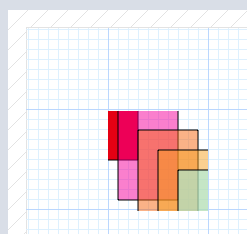
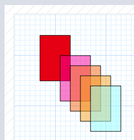

## hmRep_SET LAYER CLIP ( Area; ID ; Left ; Top ; Right ; Bottom )
###### Introduced in v4.0, Preemptive: yes

|Parameter|Type|In/Out|Description
|---|---|:---:|---
|Area|Longint|→|Area reference
|ID|Longint|→|ID of the layer
|Left|Real|→|Left coordinate of the clip
|Top|Real|→|Top coordinate of the clip
|Right|Real|→|Right coordinate of the clip
|Bottom|Real|→|Bottom coordinate of the clip

### Description
The command *hmRep_SET LAYER CLIP* sets a clipping rectangle to a layer defined by the parameter *ID*. Pass the coordinates of the clipping rectangle in the parameters *Left*, *Top*, *Right* and *Bottom*. If you want to deactive clipping, you have to pass in all coordinates parameters zero values.

### Example
The following example clips the layer with the id *1* to a rectangle of 100;100;200;200:

```4d
hmRep_SET LAYER CLIP($vl_area; 1; 100; 100; 200; 200)
```

Result:



The remove the clipping:

```4d
hmRep_SET LAYER CLIP($vl_area; 1; 0; 0; 0; 0)
```

Result:


