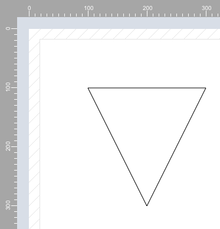

## hmRep_Create Path ( Area ; path) → object ID
###### Introduced in v1.0, Preemptive: yes

|Parameter|Type|In/Out|Description
|---|---|:---:|---
|Area|Longint|→|hmReports area
|Path|Text|→|path
|Object|ID|←|new object ID

### Description
The command *hmRep_Create Path* creates a new path object, with the help of a path description. The path description is a standard of SVG. The command is very convenient, because you can easily describe paths or you can easily import SVG objects.

For more information of the path data decription see:

[https://www.w3.org/TR/SVG/paths.html](https://www.w3.org/TR/SVG/paths.html)

### Example
The following example creates a triangle with the path description:

```4d
$vl_id:=hmRep_Create Path(hmRep; "M 100 100 L 300 100 L 200 300 z")
```

This is the result:


