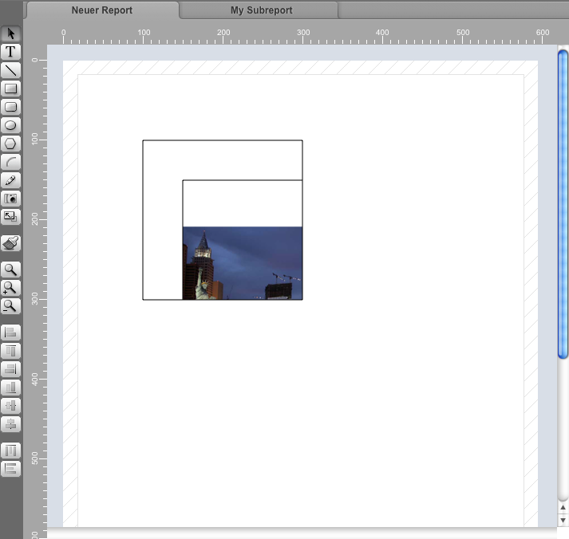

## hmRep_Create Subreport ( Area ; left ; top ; right ; bottom ; subreportUUID) → object ID
###### Introduced in v2.0, Preemptive: yes

|Parameter|Type|In/Out|Description
|---|---|:---:|---
|Area|Longint|→|hmReports area
|Left|Real|→|left coordinate
|Top|Real|→|top coordinate
|Right|Real|→|right coordinate
|Bottom|Real|→|bottom coordinate
|SubreportUUID|Text|→|UUID of the subreport
|Object|ID|←|new object ID

### Description
The command *hmRep_Create Subreport* creates a subreport object. In *left*, *top*, *right* and *bottom* you pass the coordinates of the new object. The parameter *subreportUUID* defines the subreport UUID. The parameter *subreportUUID* can be an empty string. Later you can set the subreport uuid with [[hmRep_SET OBJECT PROPERTY]] and the selector *hmRep_oprop_SubreportUUID*.

### Example
The current example creates a new subreport with a picture on it beside the main report and creates a subreport object to bind the subreport:

```4d
var $vt_subreport; $vt_currentreport : Text
var $vl_area; $vl_id : Integer
var $vb_1 : Picture

$vt_subreport:=hmRep_Create Report($vl_area; 0; 0; "My Subreport")

$vt_currentreport:=hmRep_Get Current Report($vl_area)

hmRep_SET CURRENT REPORT($vl_area; $vt_subreport)

$vl_id:=hmRep_Create Picture($vl_area; 50; 50; 400; 400)

READ PICTURE FILE(Get 4D folder(Current resources folder)+"testpic1.jpg"; $vb_1)
hmRep_SET PICTURE($vl_area; $vl_id; $vb_1)

hmRep_SET CURRENT REPORT($vl_area; $vt_currentreport)

$vl_id:=hmRep_Create Subreport($vl_area; 100; 100; 300; 300; $vt_subreport)
```
This is the result:


