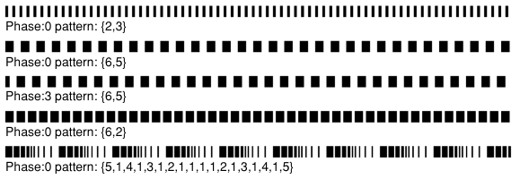
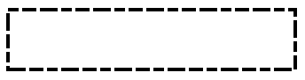

## hmRep_SET OBJECT LINEDASH ( Area ; objectID ; phase ; arrayDashes)
###### Introduced in v3.1, Preemptive: yes

|Parameter|Type|In/Out|Description
|---|---|:---:|---
|Area|Longint|→|hmReports area
|ObjectID|Longint|→|object-id
|Phase|Real|→|Phase to begin
|ArrayDashes|ARRAY|→|Dashes array

### Description
The command *hmRep_SET OBJECT LINEDASH* sets the line dash pattern of an objects frame. A line dash pattern allows you to draw a segmented line as the frame. You control the size and placement of dash segments along the line by specifying the dash array and the dash phase.
The *phase* parameter specifies the starting point of the dash pattern. The array *arrayDashes* specifies the widths of the dashes, alternating between the painted and unpainted segments of the line.
To reset a frame to its default value, just set an empty array.

Examples of line dash patterns:



The following objects support line dash patters: text, pictures, lines, rectangles, ovals, paths, freehand and arcs.

### Example
The following examples sets a special line dash for a recangle object:

```4d
var $vl_id : Integer

$vl_id:=hmRep_Create Rectangle(hmReports; 100; 200; 181; 217)

ARRAY REAL($tz_dashes; 6)
$tz_dashes{1}:=5
$tz_dashes{2}:=1
$tz_dashes{3}:=4
$tz_dashes{4}:=1
$tz_dashes{5}:=3
$tz_dashes{6}:=1

hmRep_SET OBJECT LINEDASH(hmReports; $vl_id; 0; $tz_dashes)
hmRep_SET OBJECT PROPERTY(hmReports; $vl_id; hmRep_oprop_ShowFill; 0; "")
```
Result:


