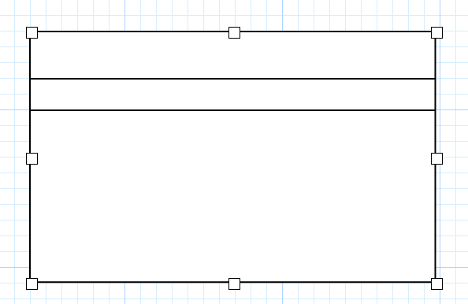

## hmRep_SET RECT ROWS ( Area ; objectID ; rowsArray)
###### Introduced in v5.3, Preemptive: yes

|Parameter|Type|In/Out|Description
|---|---|:---:|---
|Area|Longint|→|hmReports area
|ObjectID|Longint|→|object-id
|RowsArray|ARRAY REAL|→|Positions

### Description
The command *hmRep_SET RECT ROWS* defines the position of horizontal lines within a rectangle object. If the object id is not an rectangle, the command does nothing.
The parameter *rowsArray* must be filled with the local positions of the lines.

### Example
The following examples defines two lines for the rectangle object:

```4d
ARRAY REAL($tz_rows;2)
$tz_rows{1}:=50
$tz_rows{2}:=30

hmRep_SET RECT ROWS ($vl_area;1;$tz_rows)
```
Result:


