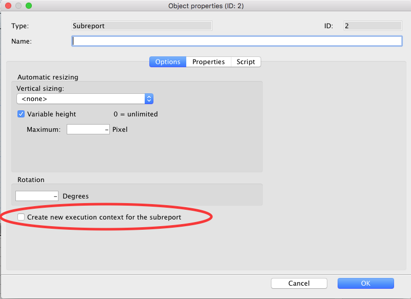
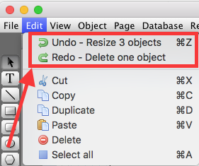

## Version 19.0 (July, 2021)

* Support of Apple Silicon M1 processor
* Support of High-DPI (Windows) with 4D v19R4
* Scripts: Support of For Each-Loop
* Scripts: Better Support of Objects and Collections
* New command to get all areas: [hmRep_Get Areas](Areas/hmRep_GetAreas.md)
* New command: [hmRep_SET VARIABLE OBJECT](Scripting/hmRep_SetVariableObject.md)

## Version 18.0 (January, 2020)

* The event *hmRep_OnClickObject* now returns, if a contextual click happens

## Version 6.1 (October 26th, 2018)

* New PDF tools:
    * [hmRep_Create Report With PDF] creates a report based on the PDF measures
    * [hmRep_Print Over PDF] prints a report over a PDF file
    * [hmRep_PDF Split]] splits one PDF into one PDF file per page
    * [hmRep_Combine PDF]] combines two PDF files into one
* The executer and hmReports offscreen areas are thread safe now.
* The parameters of the commands [hmX_SET ALLOWED COMMANDS] and [hmX_GET ALLOWED COMMANDS] has changed
* New commands [hmRep_GET RECT COLUMNS](Objects/hmRep_GetRectColumns.md) and [hmRep_GET RECT ROWS](Objects/hmRep_GetRectRows.md)
* New command [hmX_Execute] to execute a tokenized method
* New command [hmX_GET CONTEXT LIST] for returning all contexts
* The new command [hmRep_Get Current Thread ID] returns the current thread ID
* The current tips delay is now supported in hmReports

## Version 6.0 (July 24th, 2018)

* New parameters in the commands [[hmRep_CREATE STYLED TEXT RUN]] and [[hmRep_GET STYLED TEXT RUN]] to support background colors (macOS only)
* New command for sorting layers: [hmRep_SORT LAYER](Layers/hmRep_SortLayer.md)
* New commands for handling report-scripts: [[hmRep_CREATE METHOD]], [[hmRep_DELETE METHOD]], [[hmRep_GET METHOD LIST]], [[hmRep_SET METHOD]] and [[hmRep_Get Method]]
* New object option *hmRep_oprop_Full_Lines* to show fully lines only
* Changed commands: [[hmX_Count Variables]], [[hmX_GET VARIABLE BY INDEX]], [[hmX_GET POINTER BY INDEX]], [[hmX_GET ARRAY BY INDEX]], [[hmX_GET BLOB BY INDEX]] and [[hmX_GET PICTURE BY INDEX]]; these commands don't require the methodname-parameter anymore. You have to pass a stack_id. If the stack_id equals 0, local variables are returned from the latest executed method.
* The command [[hmX_GET LAST ERROR]] accepts a new parameter for the methodname, where the error occurs
* New command [hmRep_SET NEW AREA FOCUSABLE](Areas/hmRep_SetNewAreaFocusable.md)
* The event **hmRep_OnScriptError** now returns a JSON object with all information where the error occurs
* New printing session commands [hmRep_OPEN PRINTING JOB](Printing/hmRep_OpenPrintJob.md) and [hmRep_CLOSE PRINTING JOB](Printing/hmRep_ClosePrintJob.md) to print several reports into one printing job or PDF
* Change of [[Object manipulation]]. $0 can now be any type (also numbers and dates). You can set the object's data source to formula to select a data format for numbers, dates.
* New command [hmRep_Is Old Script](Scripting/hmRep_IsOldScript.md)
* New command [[hmRep_Get Styled Text]]

##  Version 5.3 (December 7th, 2017)

* New DPI parameters in the commands [hmRep_RENDER TO PICTURE](Areas/hmRep_RenderToPicture.md) and [hmRep_Report To Picture](Reports/hmRep_ReportToPicture.md).
* New commands to maintain allowed 4D commands in the script executer: [hmX_SET ALLOWED COMMANDS] and [hmX_GET ALLOWED COMMANDS]
* New commands to manage the visibility of tool in the toolbar: [hmRep_SET TOOL VISIBLE](Areas/hmRep_SetToolVisible.md) and [hmRep_Get Tool Visible](Areas/hmRep_GetToolVisible.md)
* New commands to add columns and rows to a rectangle object: [hmRep_SET RECT COLUMNS](Objects/hmRep_SetRectColumns.md) and [hmRep_SET RECT ROWS](Objects/hmRep_SetRectRows.md). This feature is also available through the contextual menu of the editor
* New object property to set the kerning of the text
* New you can put 4D code directly into static text between the tags <% and %>
* New report property to display an icon, if the text is overlowing the bounds

##  Version 5.2 (June 28th, 2017)

* New internal script-command *_SET ANCHOR* to create a table of contents very easily.
* New Undo-commands for creating undo-actions by programming language: [hmRep_START UNDO RECORDING], [hmRep_Validate Undo Recording] and [hmRep_CANCEL UNDO RECORDING]

## Version 5.1 (April 13th, 2017)

* New Undo commands: [hmRep_SET UNDO TYPE STATE] and [hmRep_Get Undo Type State]
* New object properties for getting the section of objects in the preview
* New object property to set a custom text for NULL field values

## Version 5.0 (January 11th, 2017)

* New commands from copy and paste entire pages: [hmRep_GET PAGE](Pages/hmRep_GetPage.md) and [hmRep_SET PAGE](Pages/hmRep_SetPage.md)
* New command [hmRep_Get Last Event](Areas/hmRep_GetLastEvent.md)
* Justified alignment is now supported for text objects
* It is now possible to use the main execution context in sub report containers. A new option in the *object properties*-dialog is available as well as in the programming language:

* New picture formats under Windows: WMP and DDS
* New object properties for setting the visibility of the drag handles (hmRep_oprop_DragLeftTop, hmRep_oprop_DragTop, hmRep_oprop_DragRightTop, hmRep_oprop_DragRight, hmRep_oprop_DragRightBottom, hmRep_oprop_DragBottom, hmRep_oprop_DragLeftBottom, hmRep_oprop_DragLeft)
* New command [hmRep_Get Section Count](Sections/hmRep_GetSectionCount.md)
* New section option for page footers: hmRep_svisible_NotOnLastPage
* New options to set the origin of a layer and their objects
* Rewritten intelligent undo/redo functionality:

* Changes:
    * In v4, rendering a subreport executes the start, body and end-script of the main report. This was wrong. Now you have to use the **report header/footer**-script of the subreport for executing code in the subreport context.
    * Mac: Availability in x64
    * Mac: path handling was changed to native posix format. This change effects following commands:
        * [[hmRep_Get Resources Folder]].
        * [hmRep_SET AREA PROPERTY](Areas/hmRep_SetAreaProperty.md) selector *hmRep_prop_SVGrootFolder*
        * [hmRep_SET PRINT OPTION](Printing/hmRep_SetPrintOption.md) selector *hmRep_destination_option*
    * Win: Complete rewriting of the rendering engine: hmReports 5 uses Direct2D and DirectWrite
    * Win: Export of the picture format *emf* is not available anymore ([hmRep_Report To Picture](Reports/hmRep_RenderToPicture.md), [hmRep_RENDER TO PICTURE](Reports/hmRep_RenderToPicture.md). To output vector pictures, you should use SVG instead.
    * Printing over 4D is currently not possible (v15); this affects **Print form** and **OPEN PRINTING JOB**
    * Removing the command [hmRep_SAVE UNDO]

## Version 4.2 (June 15th, 2016)

* New area property for designing sections with heights in sum can be higher than the page height.
* New report property for hide and show the page list (which is now a report property)
* New report property for hide and show the report editor
* New object property for vertical alignment of text objects
* New event *hmRep_OnCurrentReportChanged*

## Version 4.1 (April 14th, 2016)

* New commands for saving and restoring the entire virtual structure:
    * [[hmRep_VStructure To Blob]]
    * [[hmRep_BLOB TO VSTRUCTURE]]

## Version 4.0 (November 26th, 2015)

* New commands to set/get automatic relations in hmReports globally: [hmRep_SET AUTOMATIC RELATIONS](Areas/hmRep_SetAutomaticRelations.md) and [hmRep_GET AUTOMATIC RELATIONS](Areas/hmRep_GetAutomaticRelations.md)
* New command to get the total count of rendered pages: [hmRep_Enumerate Pages](Reports/hmRep_EnumeratePages.md). There is also a variable available in the script editor
* It is now possible to set/get a clipping area for each layer: [hmRep_SET LAYER CLIP](Layers/hmRep_SetLayerClip.md), [hmRep_GET LAYER CLIP](Layers/hmRep_GetLayerClip.md)
* New properties of a layer to lock a layer horizontally and vertically: *hmRep_lprop_H_Scrollable*, *hmRep_lprop_V_Scrollable*
* It is now possible to order a layer. New layer property *hmRep_lprop_Z_Order*.
* New event *hmRep_OnScriptEditor* to handle the new script editor.
* New color attribute to set the default guide color: *hmRep_clr_DefaultGuide*
* New color attribute to set the color of object bounds: *hmRep_clr_ObjectBounds*
* The virtual structure can now defined globally for the current 4D application
* **Important:** These commands now accept a *0* as area-parameter. If you pass *0* as area, the command applies changes to the global virtual structure
    * [[hmRep_TOKENIZE]]
    * [[hmRep_Detokenize]]
    * [[hmRep_Search VStructure]]
    * [[hmRep_GET VSTRUCTURE PROPERTY]]
    * [[hmRep_SET VSTRUCTURE PROPERTY]]
    * [[hmRep_GET VSTRUCTURE LIST]]
    * [[hmRep_DELETE VSTRUCTURE]]
    * [[hmRep_Create VStructure Meth]]
    * [[hmRep_Create VStructure Table]]
    * [[hmRep_Create VStructure Field]]
    * [[hmRep_Create VStructure Var]]
    * [[hmRep_Create VStructure Group]]
* A hmReports area can now use a global virtual structure. You can activate this mechanism by calling the area property *hmRep_prop_UseVStructure*.
* New command [[hmRep_GET VSTRUCTURE ARRAYS]] for getting all information about virtual structure items in one command
* New commands for getting and setting the native print header: [hmRep_Get Native Print Header](Printing/hmRep_GetNativePrintHeader.md) and [hmRep_SET NATIVE PRINT HEADER](Printing/hmRep_SetNativePrintHeader.md)
* New command for getting information about the import process [hmRep_GET IMPORT PROTOCOLL](Reports/hmRep_GetImportProtocoll.md)
* hmReports now remembers the size and positions of each dialog in the current session. There are commands for setting and getting the positions of each window: [[hmRep_GET DIALOG RECT]] and [[hmRep_SET DIALOG RECT]]
* New events for handling dialogs: *hmRep_OnOpenDialog* and *hmRep_OnCloseDialog*
* New command [hmRep_Get String Width]
* New command for changing the current cursor [hmRep_SET CURSOR](Areas/hmRep_SetCursor.md)
* New command for limiting mouse movements: [hmRep_SET MOUSE LIMITS](Areas/hmRep_SetMouseLimits.md)
* New command for fast removing of objects: [hmRep_DELETE OBJECTS](Objects/hmRep_DeleteObjects.md)

## Version 3.3 (June 4th, 2015)

* The events *hmRep_OnBeforePrinting* and *hmRep_OnAfterPrinting* now returning the current context id in *$4*
* The status bar shows the bounds in ruler units now
* Bugfix: Deactivating section property "print on report" does not work anymore

## Version 3.2 (July 7th, 2014)

* New options in [hmRep_SET AREA PROPERTY](Areas/hmRep_SetAreaProperty.md)
* New 4D commands available in scripts
* Bugfixing

## Version 3.1 (February 26th, 2014)

* It is now possible to rotate groups which have rotated objects
* It is now possible to rotate subreport objects
* New commands of the (independent) executer:
    * [[hmX_SET ARRAY]]
    * [[hmX_GET ARRAY]]
    * [[hmX_GET BLOB BY INDEX]]
    * [[hmX_GET ARRAY BY INDEX]]
    * [[hmX_GET ARRAY ELEMENT]]
    * [[hmX_DETOKENIZE TO ARRAYS]]
    * [[hmX_DETOKENIZE CTX TO ARRAYS]]
* Some new commands are now available in the Executer
* Setting the best object size of a text object (Menu)
* New command [[hmRep_Get Font Family Name]]
* Bugfixing

## Version 3.0 (October 17th, 2013)

* New script editor, script executer and script debugger
* New command topic: Scripting
* New command [hmRep_Render To HTML](Reports/hmRep_RenderToHTML.md)
* Each object has now an "On After" and "On After Render"-Script
* Internal PDF rendering engine for creating PDF's on Windows (without additional software or printer driver)
* New options available in [hmRep_SET PRINT OPTION](Printing/hmRep_SetPrintOption.md)
* hmReports works now together with the 4D print session command "OPEN PRINTING JOB"
* New command [hmRep_GET PAPER SIZE](Printing/hmRep_GetPaperSize.md)
* New command [hmRep_GET SECTION BY POINT](Sections/hmRep_GetSectionByPoint.md)
* New command [hmRep_Create VStructure Meth]
* New event *hmRep_OnDropAction*
* Endmarks are now available for path and freehand objects
* New object property: *hmRep_oprop_Resizeable*
* Support of 4D's edit menu; new area property *hmRep_prop_Use4DEditMenu*
* It's now possible to write directly :xliff: in static text objects
* Each page have now it's own pagewidth, pageheight and margins
* [hmRep_Report To Picture](Reports/hmRep_ReportToPicture.md) supports EMF format (Windows)
* The command [hmRep_RENDER TO PICTURE](Reports/hmRep_ReportToPicture.md) supports SVG and EMF output
* New commands [hmRep_SET TOOL TIP TEXT](Areas/hmRep_SetToolTipText.md) and [hmRep_Get Tool Tip Text](Areas/hmRep_GetToolTipText.md) for setting tip texts for the tool-buttons
* New commands [hmRep_SET FORMAT LIST](Areas/hmRep_GetFormatList.md) and [hmRep_GET FORMAT LIST](Areas/hmRep_GetFormatList.md) for managing the format popup in the object properties dialog
* New command [hmRep_GET RENDER LOG](Printing/hmRep_GetRenderLog.md) for getting the current call chain (log)

## Version 2.4 (February 13th, 2013)

* Bugfixing

## Version 2.3 (July 26th, 2012)

* Now you can group virtual items (fields and variables). See [[hmRep_Create VStructure Group]].
* Support of line dashes for all object types (except groups): [hmRep_SET OBJECT LINEDASH](Objects/hmRep_SetObjectLineDash.md).
* Support of vertical linespacing in text
* Support of strike-through text
* New object option for repeating objects: hmRep_oprop_ReplaceItemsIfEmpty
* New area properties: *hmRep_prop_SavePrinterName*, *hmRep_prop_DragRedrawInterval*, *hmRep_prop_SavePrintHeader*, *hmRep_prop_LoadPrintHeader*
* New report properties: *hmRep_rprop_UUID_Preview*, *hmRep_rprop_UUID_Origin*, *hmRep_rprop_Closeable*
* Bugfixing:
    * Support of interprocess variables starting with the old diamant character; it's now automatically converted into <>
    * SuperReport Pro conversion: converts now picture formats (static and dynamic pictures)
    * SuperReport Pro conversion: converts now the section property "keep whole section on page"
    * Memory leak in *hmRep_Report To Picture*
    * A crash executing the callback can happen

## Version 2.2 (February 15th, 2012)

* Support of 2D Arrays
* New ruler unit]-API for creating custom ruler units
* New event: hmRep_OnBeforeDragNewObj
* Creating straight lines while holding down the shift key
* New command [hmRep_Get Resources Folder]
* New command [hmRep_SET PATH](Objects/hmRep_SetPath.md)
* Bugfixing

## Version 2.1 (January 3rd, 2012)

* New command [hmRep_GET OBJECTS BY POINT](Objects/hmRep_GetObjectsByPoint.md)
* New command [hmRep_ZOOM TO RECT](Reports/hmRep_ZoomToRect.md)
* New [Events]
* Improved SVG export (Arcs)
* Improved behavior if the user clicks on a path
* Better SuperReport Pro conversion/compatibility
* Bugfixing

## Version 2.0 (November 21st, 2011)

* Editable Preview
* Unlimited Undo/Redo support
* Reports now can have more than one page (each page can be a separate report)
* Much better API for guides
* Support of repeating objects
* Variable headers and footers
* Support of Styled Text
* New API for creating a Virtual Structure for Tables, Fields and Variables
* Integration of 1D Barcodes, 2D Barcodes and stacked Barcodes (over 60 types)
* You can now change the name of each section
* New grid
* Arrange objects horizontally and vertically
* Support of line endmarks of line objects
* 64 bit Plugin (for 4D v12 Server 64 bit on Windows)
* New utility commands [hmRep_GET PICTURE TYPES], [hmRep_INDEX2RGB], [hmRep_RGB2Index]
* New Property Palette
* Supported languages of the GUI: English, German, French, Spanish, Japanese
* Better 4D Draw Import
* New events for Drag & Drop and printing control
* Direct Copy & Paste from the Finder/Explorer
* Bugfixing

## Version 1.3 (May 10th, 2011)

* New convenient PDF printing capabilities under Windows like under Mac OS X
* New selectors in [hmRep_SET PRINT OPTION](Printing/hmRep_SetPrintOption.md) for setting the printer only for the next document (print session) without changing the current printer.
* New command [hmRep_RENDER TO PICTURE](Reports/hmRep_RenderToPicture.md) to create previews of the final report.
* This update fixes a problem if automatic-iteration-arrays are used in deeper detail section (more than 1).
* Fixed a bug where the print settings are not correctly used from a stored hmReports file in 4D v12
* Better 4D Draw Import
* Bugfixing

## Version 1.2 (March 22nd, 2011)

* New theme: *Menus* to fully customize the menus in hmReports
* New command [hmRep_GET REPORT LIST](Areas/hmRep_GetReportList.md) to get a list of all reports of the area
* New command [hmRep_SEARCH PROP BY NAME] for searching properties
* It is now possible to show the object order (new menu item and property)
* New property in [hmRep_SET REPORT PROPERTY](Reports/hmRep_SetReportProperty.md): *hmRep_rprop_ShowObjectOrder*
* The current layer can now changed in the layerlist by doubleclick
* It is now possible to bring an object one step forward and one step backward
* It is not possible to draw on a layer which is now visible, an alert is shown
* New Callback events are available
* It's now possible to hide not needed sections and setting the name of each section
* It's now possible to scale path and freehand objects and groups
* It's now possible to rotate objects
* New command [hmRep_Render To Blob](Reports/hmRep_RenderToBlob.md) for Unicode compatibility in 4D v11
* New command [hmRep_Report To Picture](Reports/hmRep_ReportToPicture.md)
* The command [hmRep_Print](Printing/hmRep_Print.md) was modified. A result value is now returned. Please check your code!
* Fixed bug moving a group from one layer to an other

## Version 1.1 (January 6th, 2011)

* New commands [hmRep_SET EVENT STATE](Areas/hmRep_SetEventState.md) and [hmRep_Get Event State](Areas/hmRep_GetEventState.md) for activate/deactivate the event calls in the callback method
* **Important: All events are now deactivated by default. If you want to use some events in the callback, you must explict activate it with the command [hmRep_SET EVENT STATE](Areas/hmRep_SetEventState.md)**
* New command [[hmRep_GET MEMORY INFO]] for getting memory info about hmReports
* Introducing [[About Custom Properties|Custom properties]]
* New commands to setting and getting print options: [hmRep_SET PRINT OPTION](Printing/hmRep_SetPrintOption.md), [hmRep_GET PRINT OPTION](Printing/hmRep_GetPrintOption.md)
* It's now possible to make paths smooth
* New Callback events are available
* New command [hmREP_GET MOUSE](Areas/hmRep_GetMouse.md) to get the local report coordinates
* Much better picture support: Support of PDF and SVG in Fields, Variables and Arrays
* Support of picture display formats
* New buttons for alignment of objects
* New zoom buttons for zooming directly to an area

## Version 1.0 (October 28th, 2010)

* First release of hmReports
