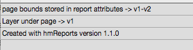

## hmRep_GET IMPORT PROTOCOLL ( Area ; Protocoll)
###### Introduced in v4.0, Preemptive: yes

|Parameter|Type|In/Out|Description
|---|---|:---:|---
|Area|Longint|→|Area reference
|Protocoll|ARRAY TEXT|←|Protocoll array

### Description
The command *hmRep_GET IMPORT PROTOCOLL* returns the latest import protocoll.
hmReports creates an internal protocoll while the following actions:

* [hmRep_BLOB TO REPORT](hmRep_BlobToReport.md)
* [hmRep_SET PAGE]
* pasting an entire page from the pastboard

The protocoll contains information about, on which OS version and hmReports version the report was stored and was happened during the import phase. It may contains parsing information, warnings or errors.

### Example
Importing an old hmReports 1.1 document into hmReports 4.0 may produce the following import protocoll:



```4d
ARRAY TEXT($tt_protocoll; 0)

hmRep_GET IMPORT PROTOCOLL($vl_area; $tt_protocoll)
```
