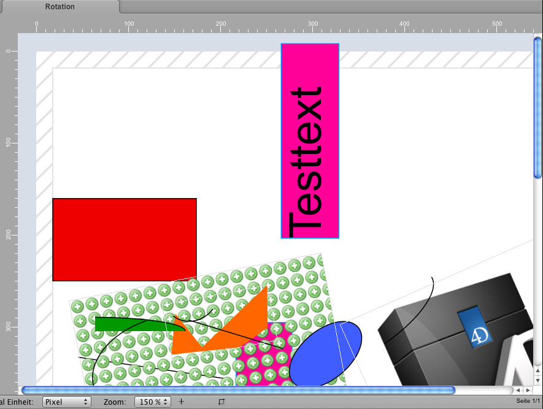
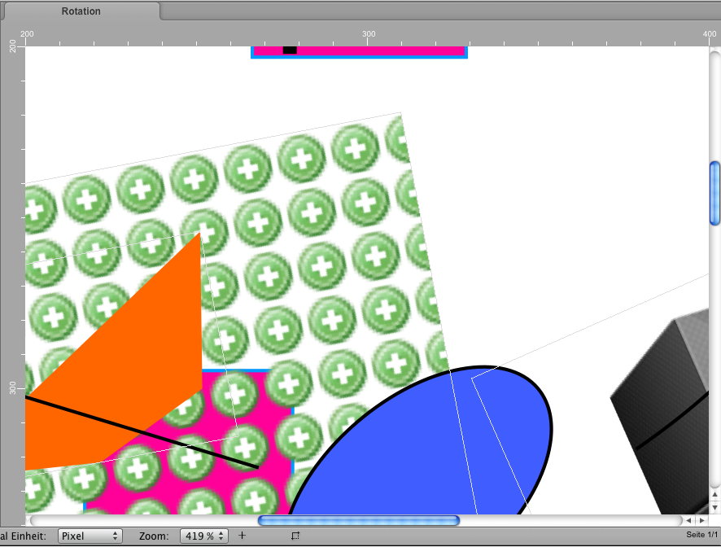

## hmRep_ZOOM TO RECT (Area ; Left ; Top ; Right ; Bottom)
###### Introduced in v2.1, Preemptive: yes

|Parameter|Type|In/Out|Description
|---|---|:---:|---
|Area|Longint|→|Area reference
|Left|Real|→|Left coordinate
|Top|Real|→|Top coordinate
|Right|Real|→|Right coordinate
|Bottom|Real|→|Bottom coordinate

### Description
The command *hmRep_ZOOM TO RECT* tries to zoom to a view rectangle defined by the parameters *Left*, *Top*, *Right* and *Bottom*.

### Example
The current example zooms to a rectangle (200;200;400;400):

The current visible frame of the current report looks like:

After calling the command

hmRep_ZOOM TO RECT (hmRep;200;200;400;400)

the frame is zoomed to:

