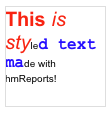

## hmRep_CREATE STYLED TEXT RUN ( Area ; objectID ; from ; to ; fontname ; fontsize ; fontstyle ; red ; green ; blue ; alpha ; back-red ; back-green ; back-blue ; back-alpha)
###### Introduced in v6.0, Preemptive: yes

|Parameter|Type|In/Out|Description
|---|---|:---:|---
|Area|Longint|→|hmReports area
|ObjectID|Longint|→|object id
|From|Longint|→|From text position
|To|Longint|→|To text position
|Fontname|Text|→|Fontname
|Fontsize|Longint|→|Fontsize
|Fontstyle|Longint|→|Fontstyle
|Red|Longint|→|Red color component (16bit)
|Green|Longint|→|Green color component (16bit)
|Blue|Longint|→|Blue color component (16bit)
|Alpha|Real|→|Alpha channel (0-100 percent)
|Back-red|Longint|→|Red color component (16bit)
|Back-green|Longint|→|Green color component (16bit)
|Back-blue|Longint|→|Blue color component (16bit)
|Back-alpha|Real|→|Alpha channel (0-100 percent)

### Description
The command *hmRep_CREATE STYLED TEXT RUN* creates a styled text run for the text object, defined by the parameter *objectID*. You have to pass the fontname, fontsize and fontstyle into the command. In *red*, *green* and *blue* you have to pass each color component into that command as 16 bit. *Alpha* defines the alpha channel, where you can pass values from 0 to 100 (percent). A value of 100 means 100 % opaque.
In *back-red*, *back-green* and *back-blue* you have to pass each color component for the background color. *back-alpha* defines the alpha channel of the background color. Default is *0*, which means: no background visible. Background color is currently supported under Mac only.

### Example
The following example creates a text object, set the multi style flag and sets the styled text runs:

```4d
$vl_object:=hmRep_Create Text(reparea; 100; 100; 200; 200; "This is styled text made with hmReports!")

hmRep_SET OBJECT PROPERTY(reparea; $vl_object; hmRep_oprop_Multistyle; 1; "")

hmRep_CREATE STYLED TEXT RUN(reparea; $vl_object; 1; 4; "Arial"; 20; Bold; 0xFFFF; 0; 0; 100; 0; 0; 0; 0)
hmRep_CREATE STYLED TEXT RUN(reparea; $vl_object; 5; 11; "Arial"; 20; Italic; 0xFFFF; 0; 0; 100; 0; 0; 0; 0)
hmRep_CREATE STYLED TEXT RUN(reparea; $vl_object; 14; 22; "Courier New"; 16; Bold; 0; 0; 0xFFFF; 100; 0; 0; 0; 0)
```
This is the result:


