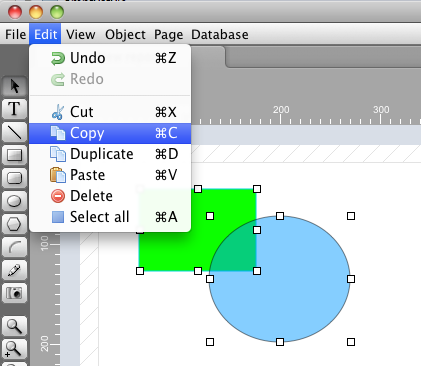
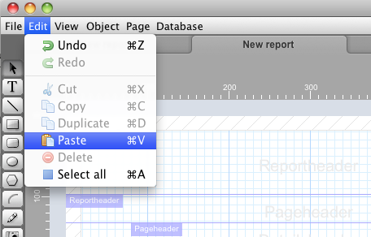
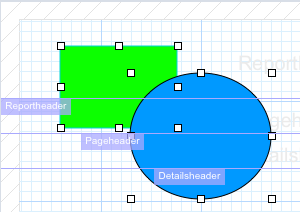
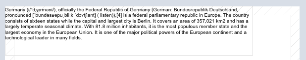
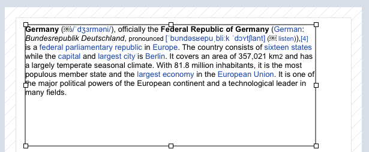
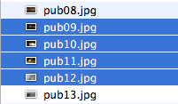
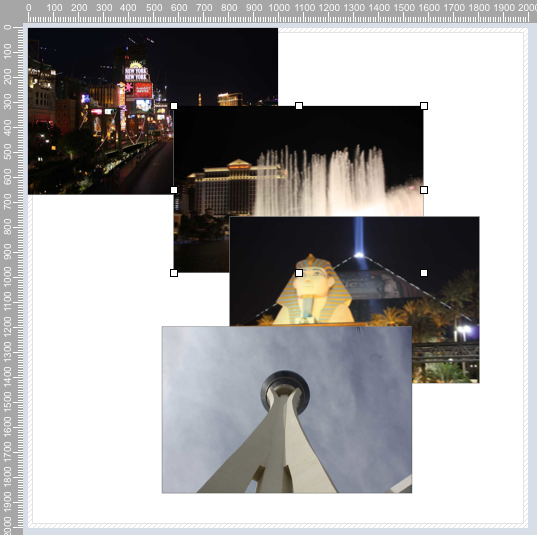

hmReports does support Copy and Paste in a very convenient way. You can copy one ore more objects or groups in a hmReports  Area  and you can paste the objects in the same report or in an other report in an other application.

## How to copy an object from one area to an other area

Select one or more object you want to copy. Then goto the menu and select Edit>Copy:

Note: You can also reach the copy item with the right mouse click or the keyboard (Cmd+C).

Now you can go to an other report area or you can paste the objects into the same area you have copied it from. Select Edit>Paste:

Now the objects are pasted into the report:

You can repeat the last paste action as long as you want. The objects still remain in the clipboard.

## How to insert external content into hmReports

*External content* can be any type of data related to hmReports. This can be text or pictures.

### Paste plain text into hmReports

You can select text from an other application, e. g. Safari or Textedit:

Then just goto the hmReports menu Edit>Paste. And you will have this result:

hmReports created a new object for the text.

### Paste multi style text into hmReports

You can select text from an other application and you can paste the text with its styles into hmReports.
You have to do the following things:

- Copy styled text from an other application
- Create a new text object in hmReports
- Goto into the object properties and enable *multi style*.
- Paste the data into the contents field in the object properties of the text
- Click OK.

The result:

### Paste picture files into hmReports

You can select one or more picture files from the Mac OS Finder or Windows Explorer and you can insert them into the hmReports area directly by selecting the menu Edit>Paste.

Select some files from the Finder or Windows Explorer:

Then copy them by selecting Edit>Copy from the menu. Then goto the hmReports area and select Edit>Paste from the menu. You will have this result:

