Lets build a simple customer report from scratch.

### Step 1: Define the structure

First, we define a simple structure with customers:

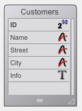

### Step 2: Embed the hmReports area

You have two possibilites to open the report editor:

- 1st: You put the hmReports area on a form:

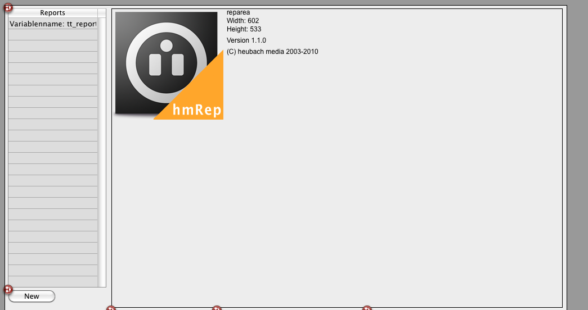

- 2nd: You start the report from the Design-Mode:

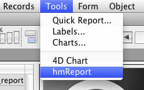

Now you see the report area with the current paper size and paper settings:

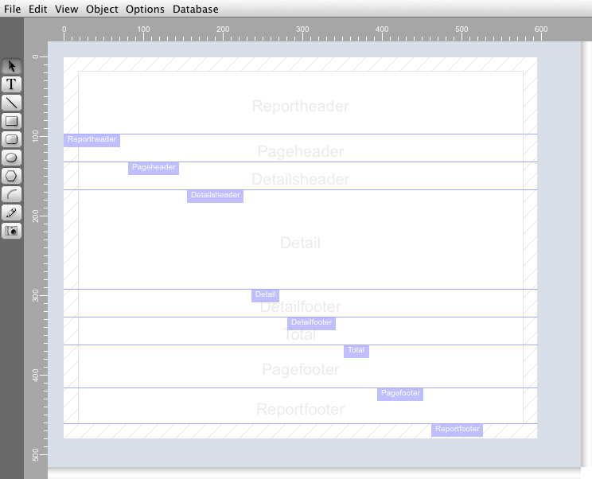

### Step 3: Set the sections you need
If you don't want some sections, you can go to the hmReports menu and select *Page>Sections*. You get the dialog:

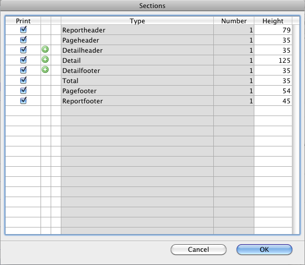

Now, you can add or deactivate some sections. For example, if you do not need a reportfooter, you can deactivate the reportfooter in this dialoge. Just deactivate the option in the column *Print*.

### Step 4: Set the iteration

To set the main iteration go to the menu *Database>Iteration settings*:

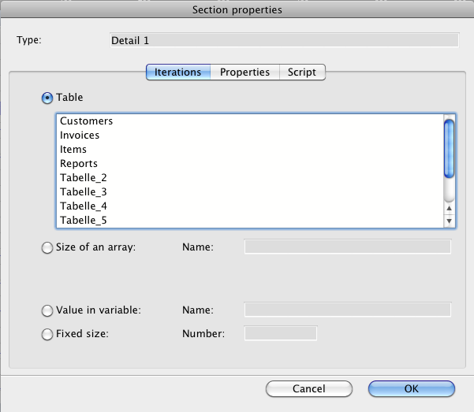

You can set an iteration based on records, arrays, variable or a fixed count. Now we chose a table in the database: *Customers*.

### Step 5: Make a selection

Now you should make a selection. You can use the 4D query editor (*Database>Search records*). But this setting is not stored in the report. It only has effect to the current selection. You should write your own selection script (start script). All scripts are stored in the report.

To set the start script go to *Database>Script>Startscript*. Now you can enter every code you want:

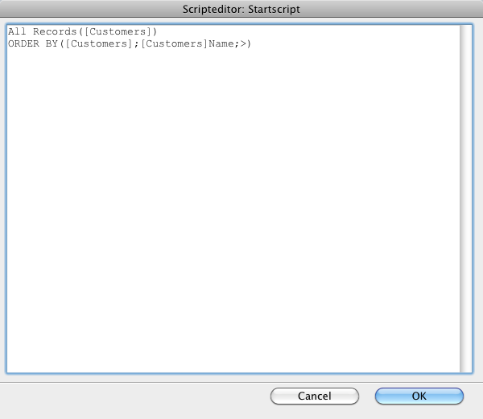

### Step 6: Insert Fields in the Report

Now you can create textobjects on the report. You can bind these objects to a datafield, array or variable. For example: Select on the left Tools-Bar the Text-Tool:

Now draw an object on the report in the detail section like this:

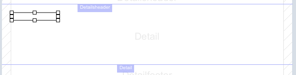

Double click on it and chose the binding *Internal database*:

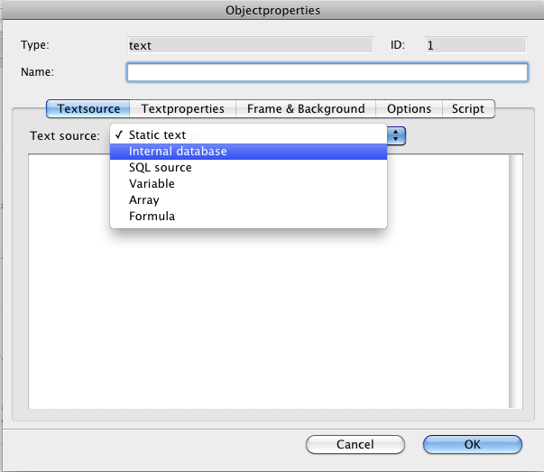

and select the field *Name*:

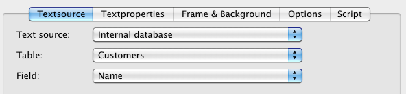

Now, you have a field on the report. You can add some more fields in that way or duplicate the object and change the binding field.

For example now you have a report like this:

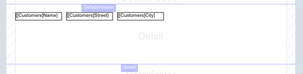

If you want some column headers, just add some text objects in the detailsheader section.

Also add a title to the report in the Reportheader. The reportheader is printed once on the first page of the report.

### Step 7: Print the Report

If i customize the sections in height and remove the frame from the objects, i have now the following report:

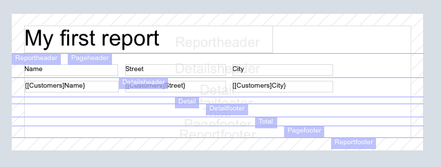

Now go to the menu *File>Print* and you will have the following output:

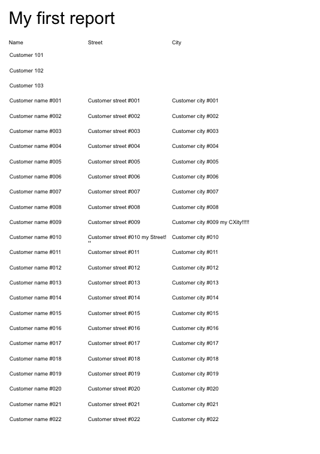
