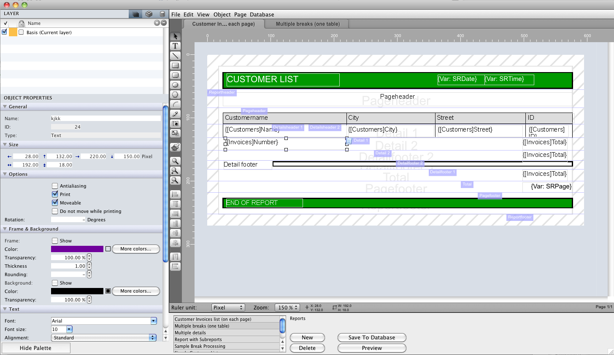
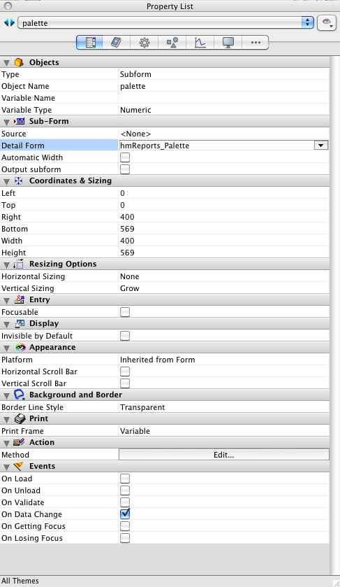

hmReports provides a shared component form (included form or subform) for displaying a properties palette for the report and objects. Also it provides a list of available layers, objects and references.

The subform looks like:



## How you create the subform

- Create a new form or use an existing hmReports form. Place an included form (subform) on it:


Note: The subform must have a width of 400 Pixels and at least a height of 300 Pixels!

- Give the subform an object name ("palette" in our example). A variable name is not needed, so it can be empty.
- Now uncheck the option *Output subform* in the object properties.
- Now select the *detail form* from the object property palette ("hmReports_Palette"):


- Uncheck horizontal and vertical scrollbar of the subform

These are the final settings of the subform:



- New you can create the hmReports-Plugin Area, which may have the object and variable name "reparea"

## How to handle the subform

The hmReports component provides some commands for handle the subform. You need to initialize the subform at the *On Load* phase of the host form:

```4d
Case of 
 : (Form event=On Load)

 hmRep_Palette_Install ("palette";reparea)

End case 
```

All other code should come after the initialization of the subform.
The method *hmRep_Palette_Install* gets as *$1* the name of the subform, which is "palette" in our example. As *$2* you should pass the hmReports Plugin Area reference.

## Update

Each time the user clicks in the hmReports Plugin Area, the Palette subform has to be updated. So, the plugin Area should update the palette subform if the following events are called:


Inside the Plugin Area object method you should place the code for updating the Palette subform:

For example:

```4d
hmRep_Palette_Update ("palette";reparea)
```

The parameter *$1* is the name of the subform and *$2* is the reference of the Plugin Area.

## Switch between pages

You can use the Palette subform and the hmReports on an other page as page 1. Also you can switch to an other page. There is no limitation like the Container.
