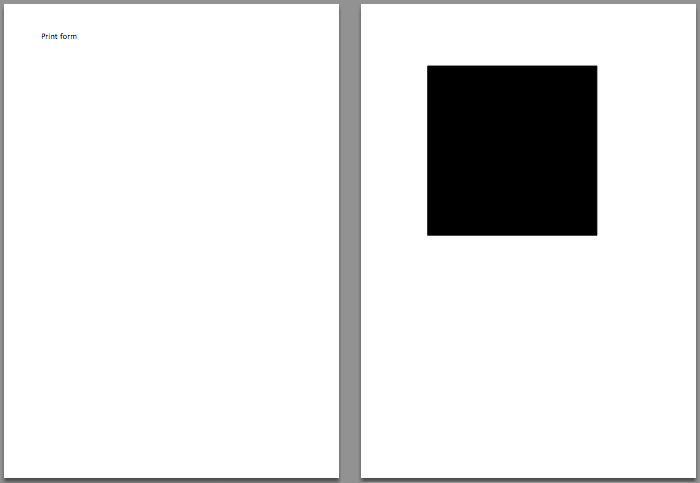

hmReports works with the 4D print session commands *OPEN PRINTING JOB* and *CLOSE PRINTING JOB*. It is now possible to print a document together with 4D print form, 4D Write, 4D View and hmReports.

Because hmReports using an existing print session of 4D, all settings you made with [hmRep_SET PRINT OPTION](../Printing/hmRep_SetPrintOption.md) are not taken. You have to use 4D commands *SET PRINT OPTION* before printing.

### Example

This example prints a 4D form (with *Print form*) and prints a hmReports document as page 2.

```4d
PRINT SETTINGS

If (OK=1)

$vl_area:=hmRep_New Offscreen Area (1000;1000)

SET PRINT OPTION(Hide printing progress option;1;0)

OPEN PRINTING JOB

$vl_height:=Print form("print_form")

PAGE BREAK(>)

$vl_id:=hmRep_Create Rectangle ($vl_area;100;100;400;400)

hmRep_SET REPORT PROPERTY ($vl_area;hmRep_rprop_PrintAsReport;0;"")  //Print as Area

$vl_error:=hmRep_Print ($vl_area;0)

CLOSE PRINTING JOB

hmRep_DELETE OFFSCREEN AREA ($vl_area)

End if 
```

Result:


