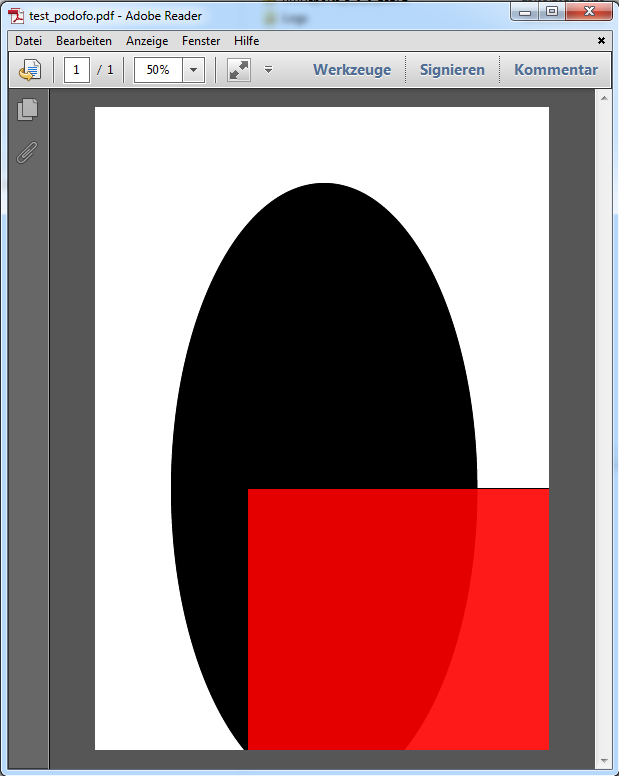

## Printing PDF under macOS

The Mac OS has a native build-in PDF generation. So we do not need additional software to create a PDF.

The following example creates a new offscreen area, draws a (black) rectangle, sets the print property to PDF output with a path, and prints the document to file:

```4d
$vl_area:=hmRep_New Offscreen Area (0;0)

$vl_id:=hmRep_Create Rectangle ($vl_area;100;100;400;400)

hmRep_SET REPORT PROPERTY ($vl_area;hmRep_rprop_PrintAsReport;0;"")  //Print as Area
hmRep_SET PRINT OPTION ($vl_area;hmRep_destination_option;3;0;Convert path system to POSIX("Macintosh HD:test.pdf")

$vl_result:=hmRep_Print ($vl_area;0) //0=no printing dialogs

hmRep_DELETE OFFSCREEN AREA ($vl_area)
```

## Printing PDF under Windows (Ghostscript)

On the Windows OS, you do not have a native PDF output. You need additional software. hmReports supports Ghostscript ([[http://ghostscript.com/]]).

If you install an additional PDF Creator Printer which uses Ghostscript (e. g. PDFCreator or FreePDF), you can still use this hmReports feature.

### Install only Ghostscript

If you only install Ghostscript, you have to install the "Ghostscript PDF" printer manually:

Download and Install Ghostscript - http://www.ghostscript.com/download/gsdnld.html
Install a new printer:
* Add a printer
* Select local
* Choose an existing port: FILE (print to File)
* Choose <Have Disk> on the install driver page
* Browse to the ghostpdf.inf in your Ghostscript install directory. E. g. at "C:\Program Files (x86)\gs\gs9.04\lib\ghostpdf.inf"
* Click through the big red "This driver isn't signed" warning and then finish up with the normal printer install process.

### Example

The code for generating PDF files under Windows is quite simple:

```4d
$vl_area:=hmRep_New Offscreen Area (0;0)

$vl_id:=hmRep_Create Rectangle ($vl_area;100;100;400;400)

hmRep_SET REPORT PROPERTY ($vl_area;hmRep_rprop_PrintAsReport ;0;"")  `Print as Area
hmRep_SET PRINT OPTION ($vl_area;hmRep_printer ;0;0;"Ghostscript PDF")
hmRep_SET PRINT OPTION ($vl_area;hmRep_destination_option ;3;0;"C:\\test.pdf")

$vl_result:=hmRep_Print ($vl_area;0)

hmRep_DELETE OFFSCREEN AREA ($vl_area)
```

If you are using 4D v12 and PDFCreator, you can use the *PDFCreator Printer name* constant to set the printer name:

```4d
hmRep_SET PRINT OPTION ($vl_area;hmRep_printer ;0;0;PDFCreator Printer name)
```

### Troubleshooting

Under Windows, you should always check for errors after you called [hmRep_Print](../Printing/hmRep_Print.md) -> [hmRep_Get Last Error].

If you got error -29, the DLL path of Ghostscript cannot be found. In this case you should check the path with [hmRep_GET PRINT OPTION](../Printing/hmRep_GetPrintOption.md) and selector *hmRep_Ghostscript_Path*.

You should search for the file *gsdll32.dll* manually. Can can set the path manually with [hmRep_SET PRINT OPTION](../Printing/hmRep_SetPrintOption.md).

## Printing PDF under Windows (Internal PDF Engine)

hmReports 3.0 introduces an internal PDF rendering engine. It is not necessary to install any PDF printer driver or additional software like Ghostscript.

To create an output into a PDF file, you have to do the following things:

- Set the *hmRep_PDF_Engine* to the value *2* in [hmRep_SET PRINT OPTION](../Printing/hmRep_SetPrintOption.md).
- Set the output path *hmRep_destination_option* to the value *3* and pass a PDF path in [hmRep_SET PRINT OPTION](../Printing/hmRep_SetPrintOption.md). If a document exists, [hmRep_Print](../Printing/hmRep_Print.md) does nothing and returns an error. You have to pass a path to a non-existing file!
- Now call [hmRep_Print](../Printing/hmRep_Print.md).

Here is an example how you can easily create a PDF with the internal PDF engine:

```4d
C_LONGINT($vl_width;$vl_height;$vl_area;$vl_id;$vl_result)
C_TEXT($vt_path)

$vl_width:=0
$vl_height:=0

//Get a standard paper size: A4
hmRep_GET PAPER SIZE (4;0;$vl_width;$vl_height)

//Create a new offscreen area with the bounds of a A4 page
$vl_area:=hmRep_New Offscreen Area ($vl_width;$vl_height)

//Do not print a report; print the area is it is
hmRep_SET PAGE PROPERTY ($vl_area;1;hmRep_pprop_PrintAsReport;0;"")

//add an oval
$vl_id:=hmRep_Create Oval ($vl_area;100;100;500;900)

//add a rectangle
$vl_id:=hmRep_Create Rectangle ($vl_area;200;500;700;1000)
hmRep_SET OBJECT PROPERTY ($vl_area;$vl_id;hmRep_oprop_ShowFill;1;"")

hmRep_SET COLOR WITH ALPHA ($vl_area;hmRep_clr_ObjectFillcolor;$vl_id;0xFFFF;0x0000;0x0000;90)

$vt_path:="C:\\hmReports\\test_podofo.pdf"

//set the output PDF file
hmRep_SET PRINT OPTION ($vl_area;hmRep_destination_option;3;0;$vt_path)

//set the PDF rendering engine to the internal engine
hmRep_SET PRINT OPTION ($vl_area;hmRep_PDF_Engine;2;0;"")

//check if the file exists; if yes - delete it
If (Test path name($vt_path)=Is a document)
DELETE DOCUMENT($vt_path)
End if 

//create the PDF file; $vl_result should be 1 (=success)
$vl_result:=hmRep_Print ($vl_area;0)

//delete the offscreen area and release memory
hmRep_DELETE OFFSCREEN AREA ($vl_area)
```

The result PDF looks like:



### Limitations

* The internal PDF rendering engine does only work on Windows.
* All pictures are currently embedded as jpg; other picture formats are converted into jpg
