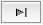
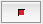
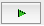
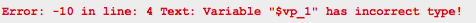
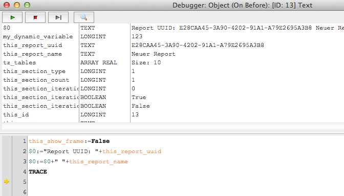
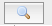

The hmReports-debugger is able to debug all hmReports-Scripts. Notice that you can only debug new scripts (introduced with hmReports 3.0). Old text-based scripts cannot be debugged, because 4D executes the script.

The hmReports-debugger is available in interpreted and compiled databases.

There are to scopes of debugging:

- 1st: Debug in report definition/design mode
- 2nd: Debug while report execution (creation)

If you are writing a script in a report definition, you can simply debug your code in the script editor if you click on the *Debug*-Button. Now the debugger appears. The first line is ready to debug.

You can step through each line with the button:

On top of the debugger you find a list with all current variables used in this method. It shows you the type and the value.

With the button

you can cancel the current debugging session.

You can run the entire script with the button:

On the buttom of the window, you find a line with the latest error code and error text:

Example:

After an error occurs, you can still step over and debug the next lines.

If you write the 4D command **TRACE**, and you run the script; then the debugger will appear at this line.

## Debug while report compilation/execution

If you want to debug your code while the report is beeing created, just write the 4D command **TRACE** in your method. Then build a preview (Menu: File>Preview). The debugger appears at this TRACE-Point.
The debugger only appears in **preview mode**. It is **not** possible to show the debugger while printing or offscreen creation. This is for security reasons; and user inferfaces are not allowed in an offscreen or prining context.

In the debugger window, you will find the object ID and the script type (On Before, On After).
If you click the *Stop*-Button, the execution stops at the last line. All following lines are not executed.

On top of the debugger window, you will find an further button:

If you press this button, you will get a preview of the current page. It shows you, how the report looks before the current debugging object is printed.
