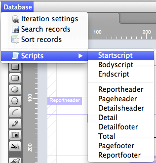
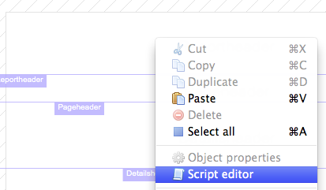
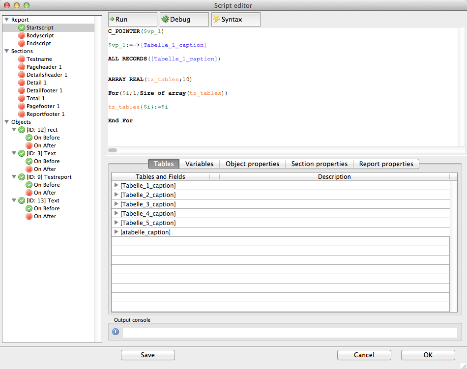
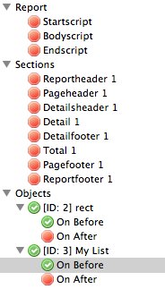
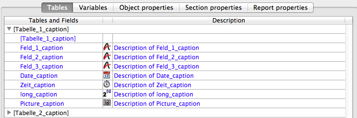
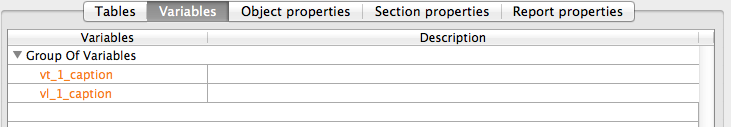
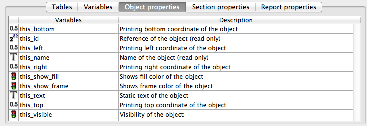

The script editor of hmReports shows now all scripts of the current report. New you have a complete overview of what is happen in your report. You see all start/end scripts, as well as section and object scripts.

### Open the hmReports Script Editor

To open a report or section script, you can use the menu bar *Database>Scripts*:

You can also use the contextual menu for opening section scripts. Just do a contextual click (right mouse click) in the section you want to edit and select *Script editor* in the menu. Now it opens the section script:

### Script Editor

On the left side you see the *Script List*. On the top you see the script writing area. On the buttom you see reference tables you can use.

### Script List
On the left side you have an overview over all scripts defined in the current report.

You are able to navigate through the list of object-scripts, sections-scripts and report-scripts. You can edit each method. Of course you can debug each method.
The green check mark indicates, that a script is available for this object. A red stop-sign indicates, that there is no script behind that object.

If you edit a script you can navigate to an other script, the last script will be saved automatically. Of course you can click the *save* button to save the method. If you edit a method and click *Cancel*, your changes will be lost.

### Script text editor

On the top of the editor you see the script writing area. There you can write your 4D code.
There you have some action buttons:
* Run: Runs the script. The output console shows the result of the method ($0). If an error occurs, the output console shows the error and the line where the error occured.
* Debug: Runs the script in the hmReports-debugger. It goes into TRACE beginning with the first line.
* Syntax: Press this button and hmReports will run through the code and updates the code. E. g. if you wrote "all records", after pressing the syntax button, hmReports validate the code and makes it to "ALL RECORDS". It does *not* checks the syntax and shows you errors.

### Reference lists

### Tables

You can fill this list with tables. You can use the original name or a virtual structure. You can also add a description for each field. You can do this with the [About Virtual Structure].

### Variables

You can fill this list with variables. You can use the original name or a virtual structure. You can also add a description for each variable. You can do this with the [About Virtual Structure].
You can group variables in this list with [hmRep_Create VStructure Group].

### Object properties

Here you find all object properties you can manipulate in the object script. It is only possible to modify object properties in the *On Before* object script! You can use this properties like variables in your code.

### Section properties

Here you find all section properties you can use in the section or object scripts. You can use this properties like variables in your code.

### Report properties

Here you find all report properties you can use in the report, sections or object scripts. You can use this properties like variables in your code.
