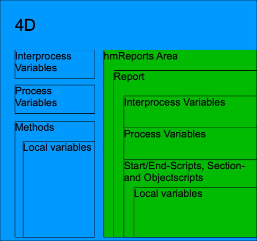

The script editor and the script executer are one of the new key features of hmReports 3.0

Beginning with hmReports 3.0 it is now allowed to use Loops, If, While, Repeat and Case-Statements as well as usage of local variables and pointers (also to local variables).

### Execution implementation

The following scheme shows the implementation of the hmReports script execution in 4D:

The hmReports execution context is completely separated from the 4D execution context. That means, that variables in hmReports are not 4D variables and vice versa. You have no access from hmReports to 4D variables and vice versa. To do that, you have to use the API explicitly to add variables to hmReports.

The advantages of the hmReports sandbox modell are:
* security: you (or the user) have/has no direct access to your 4D process and inter process variables
* avoid side effect: if you execute/compile two or more reports in one offscreen area, variables have their own space
* dynamically create variables and use local variables

**You should not use interprocess variables within hmReports scripts, because interprocess and process variables have the same scope (they are both valid in the current execution context of the report). Interprocess variables in hmReports are not available in other 4D processes.**

### Architecture

Scripts in hmReports are tokenized. That means, if you save a script, hmReports saves it not as text, it parses the script and saved it as tokens:

- 4D command: only the command id is saved
- 4D table/field: only the table and field number is saved
- Numeric, date and time expressions: are saved independly of the localization format

The advantages of tokenized scripts are:

- Scripts are independ of the 4D language localization (US or FR). You write hmReports scripts with the US-version and US commands, if you then open the method on a french 4D version, all commands are displayed correctly with french 4D commands.
- You can rename you tables and fields. Because hmReports saves the table and field number, you can rename your tables and fields and the scripts still showing their new names.

### Executer

hmReports has it's own executer for tokenized hmReports scripts.

### Debugger

Because hmReports has it's own executer it is possible to debug several lines. You can use the TRACE command in the code to show the debugger while hmReports building a preview of your report.
