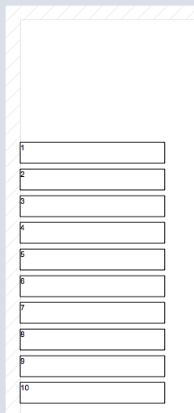

It is possible to manipulate the current object in the current code while executing a report.

You learned in the chapter [The Script Editor](ScriptEditor.md), that you have direct access to object properties within your code. You can manipulate them while report creation.

**Important: All properties you change while report-creation only applies to the target object. It does *not* change the original report object definition.**

## Script result $0

The script variable $0 is the result of the current object. It can be any type of data which you can display (text, numbers, dates, pictures).
Since hmReports 6, you can set the data source of the object to "formula". hmReports automatically shows the right format options regarding the type of $0.
**Important: You have to declare $0 explicitly with compiler commands (C...)!**

### Example 1

You want to add a header text to a report with the report UUID and the name.

- 1st: Add a new text object to the report header.
- 2nd: Write a script:

```4d
this_show_frame:=False
$0:="Report UUID: "+this_report_uuid
$0:=$0+" "+this_report_name
```

- Line 1: Hide the frame of the current object
- Line 2: Set a new text for the current object. *this_report_uuid* is a report property-variable which contains the report UUID
- Line 3: Adds the report name to the current text. *this_report_name* is also a report property variable.

For text objects, you can simply use *$0* for manipulate the text of the current object. *$0* will always replace the content of the current object!

### Example 2

Add dynamic text to a static text object.
You've added a static text-object to a report, e. g. "Testreport" and you want to add the current date and time to that string. This is now very simple.
Just add the following code to that object:

```4d
$0:=this_text+" from "+String(Current date)+" "+String(Current time)
```

Result:


### Example 3

Manipulate dynamic text.

You want to create a report with e. g. 10 lines with a fixed size array. You create the array in the report header script:

```4d
ARRAY REAL(tz_tables;10)

For($i;1;Size of array(tz_tables))

tz_tables{$i}:=$i

End For
```

Then set the iteration of detail 1 to the array *tz_tables*.
Now create a new text object and bind it to the array. All possible variables can be selected by the popup. The type of the array will be shown as an icon in front of the variable name:


The preview should now look like:



Now, we want to write a static text in front of each line. Just add the following script to that object:

```4d
$0:="Number: "+this_text
```
The result is the following:


