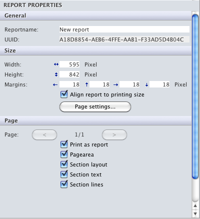
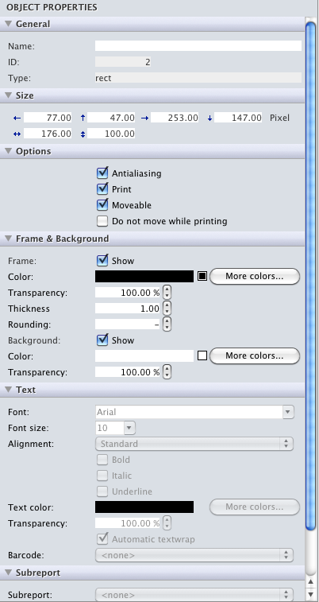
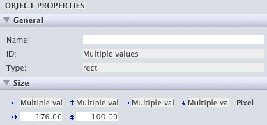
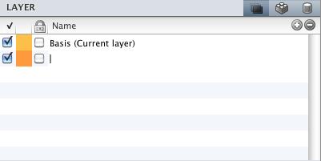
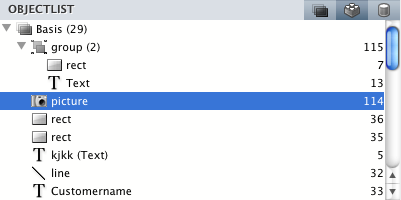
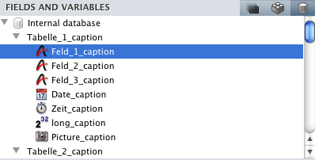
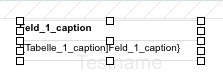

The hmReports Container provides the following features for the end-user:

## Edit report properties

If the user clicks in the report area or no object is selected, the reports properties are shown:

Also, you can change the settings of the current page under the *Page* section.

## Edit object properties

If the user clicks selects one or more objects, you can change the properties of the selected objects:

If there are more than one objects selected, you can change the properties of these objects. If some objects have different properties, the property is labeled with *Multiple values*:

## Edit layers

On top of the palette, you can see a list of all available layers. You have a button for create a new layer of delete a layer:

The first checkbox/column of the list, is the visibility of the layer. Note that at least one layer must be visible. The second column is the color of the layer. You can change the color by click on the column and line. The third column locks and unlocks a layer. If a layer is locked, the user cannot select/move objects. But the user can create new objects on the layer.
The fourth column displays the name of the column. You can easily rename the layer by clicking in the row.

If you delete a layer, note that you cannot delete the current layer and the last layer cannot be deleted.

You can set/change the current layer, by double click on the row.

## Object list

The object list shows all objects. Each layer has a sublist with all its objects and each group has a sublist with all its objects:

Each line represents an object. If the object has a name, the name is displayed in the line. If the object has no name, the type is displayed. On the right side, there is the ID of the object.

At the end of the layername or group is the count of objects.

If you select one or more objects in the object list, these objects will become the current selected objects in the current report.

## Fields and Variables list

This list shows all fields and variables (also arrays) defined explicit with the [About Virtual Structure].

You can drag and drop these fields and variables into the current report. The caption of the field/variable is automatically created above the object:

