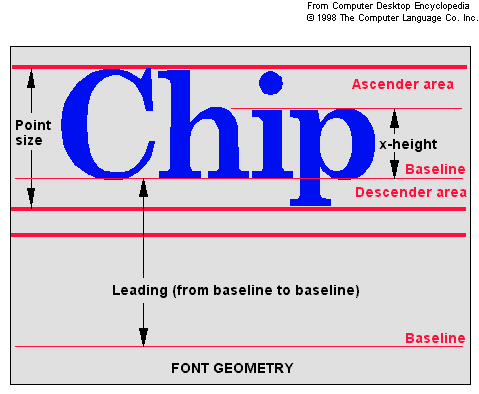

## hmRep_GET TEXT MEASURES ( Text ; Fontname ; Fontsize ; Fontstyle ; Width ; Height ; Ascent ; Descent)
###### Introduced in v4.0, Preemptive: yes

|Parameter|Type|In/Out|Description
|---|---|:---:|---
|Text|Text|→|A text value
|Fontname|Text|→|The fontname
|Fontsize|Real|→|The size of the font
|Fontstyle|Longint|→|The font style
|Width|Real|←|The width of the text
|Height|Real|←|The height of the text
|Ascent|Real|←|The ascent of the text
|Descent|Real|←|the descent of the text

### Description
The command hmRep_GET TEXT MEASURES measures the text, based on the font information: fontname, fontsize and fontstyle.

The following picture shows you the ascent, height and descent:

4D constants may be used for the style parameter. See the 4D documentation for details.
